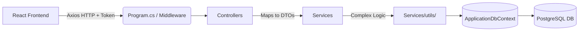

# 🌟 HRIS Comprehensive Project Architecture & File Connections 🌟

Welcome to the HRIS codebase! This document is designed for **Seniors and incoming developers** to quickly grasp the breadth of the architecture, where critical business logic lives, and exactly how files interact.

---

## 🛑 1. High-Level Macro Architecture

The system is a fully decoupled Client-Server architecture utilizing a modern stack:
*   **Web Client (`/hris`):** React 19 SPA (TypeScript + Vite) styled with Tailwind CSS & Shadcn UI.
*   **REST API (`/backend`):** ASP.NET Core 10 Web API.
*   **Database:** PostgreSQL (utilizing JSONB for dynamic task storage).
*   **Notifications:** Integrated database-driven alert system (SignalR decommissioned for stability).

### 🌐 The Standard Execution Pipeline

---

## ⚙️ 2. The Backend Engine (`/backend`) 

The backend is built around a Service-Oriented MVC Pattern with a dedicated **Utility Layer** for complex data processing.

| Component | Essential Files | Purpose & Connections |
| :--- | :--- | :--- |
| **Bootstrapper** | `Program.cs` `appsettings.json` | **The Brain.** Configures CORS, JWT Auth, and injects DB Contexts. Connects the API to PostgreSQL using connection strings in `.env` (via DotNetEnv). |
| **Utility Layer** | `Services/utils/*.cs` | **The Core Logic.** Contains migrated, high-complexity business rules (e.g., `AccomplishmentReportServiceUTILS.cs`). Separates heavy analytical processing from basic CRUD services. |
| **Database Context** | `Data/ApplicationDbContext.cs` | **The Bridge.** Maps C# `Models/` to PostgreSQL tables. Specifically handles **JSONB mapping** for the `TasksJson` column. |
| **Initializers** | `Data/SeedDatabase.cs` | Injected into `Program.cs` to auto-populate default administrative users, roles, and setup data using EF Core. |
| **Data Transports**| `DTOs/*.cs` | Data Transfer Objects define the exact JSON payload shapes. Ensures the `ApiResponse<T>` wrapper is applied to all outgoing data. |
| **Audit System** | `Services/AuditLogService.cs` | Intercepts administrative actions (Create/Update/Delete) and persists them to the `AuditLogs` table for system accountability. |

---

## 🖥️ 3. The Frontend Client (`/hris`)

A high-performance React 19 app utilizing **React Admin v5** for data orchestration but completely customized with **Shadcn UI**.

| Component | Essential Files | Purpose & Configuration |
| :--- | :--- | :--- |
| **Feature Utils** | `src/features/*/utils/*.tsx` | **Frontend Business Logic.** Contains complex client-side calculations (e.g., total hours, dashboard analytical filtering). |
| **Custom UI Root** | `src/components/` | Contains the **Shadcn UI** wrappers that replace default MUI components, ensuring a unified, premium design system. |
| **Data Provider** | `src/dataProvider.ts` | The bridge between React Admin and the .NET API. Automatically unwraps `ApiResponse<T>` and maps backend IDs. |
| **State & Auth** | `src/authProvider.ts` | Manages JWT storage, claim-based permission checks, and identity persistence. |

---

## 🛠️ 4. Global Configuration, DevOps & Automation (Root Level)

### 🚀 Automation & Setup (Plug & Play)
*   **`setup-backend.ps1`**: Located in `backend/setup_backend/`. Automatically prepares the environment, handles migrations, and starts the API on **Port 5107**.
*   **`setup-frontend.ps1`**: Located in the root. Installs dependencies and starts the Vite server on **Port 5173**.

### 🧪 E2E Testing & Playwright
*   **`PLAYWRIGHT_GUIDE.md`**: Instructions for running automated browser UI testing.
*   **`temp_employee_flow.spec.js`**: Core automated end-to-end (E2E) testing script simulating full user lifecycles.

### 🗄️ Turnover & Documentation
*   **`README.md`**: The primary project entry point.
*   **`DOCU/`**: Comprehensive technical documentation, including troubleshooting guides and setup walkthroughs for senior developers.
