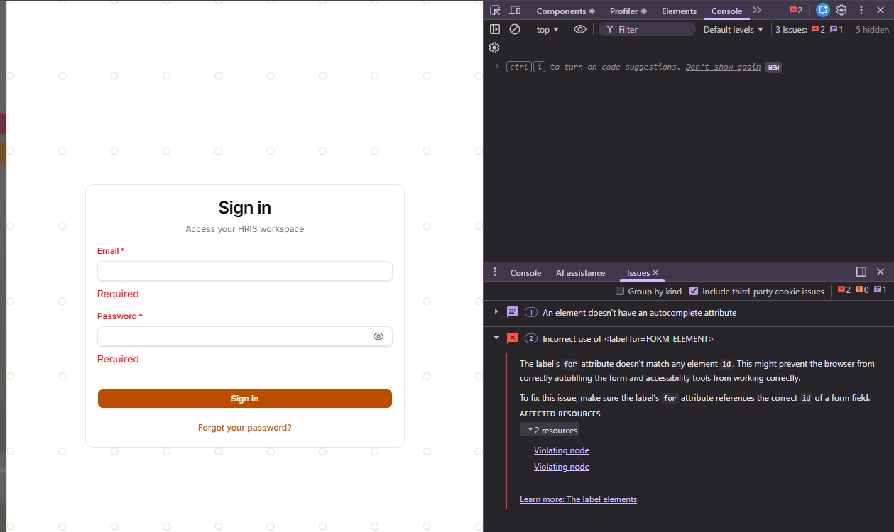

# LESSON 1.6 ACTIVITIES

# [X] ACTIVITY 1: ✅ CORRECT
    - REFER TO THE PRACTICE/LESSONS/Sandbox troubleshooting.md
    - Properly documented 404 error in PRACTICE/troubleshooting.md
    - Explained cause, fix, and prevention correctly

# [X] ACTIVITY 2: ✅ CORRECT

    - I only see 3 issues, mainly caused by <label for=FORM_ELEMENT> which it stated that it might not autofill
    `The label's for attribute doesn't match any element id. This might prevent the browser from correctly autofilling the form and accessibility tools from working correctly.`
    - this came from the login page and is mainly caused by Email label and Password label
    - Valid accessibility warnings identified correctly

# [X] ACTIVITY 3: ✅ CORRECT
    - ERROR: VM373:1 Uncaught TypeError: Cannot read properties of null (reading 'toString')
    at <anonymous>:1:6
        - ERROR TYPE: Runtime Error (JS ERROR) ✓
        - Uncaught TypeError: Cannot read properties of null (reading 'toString')
    at <anonymous>:1:6
        - refer to the `troubleshooting.md` under practice folder
    - Properly classified as Runtime Error with correct documentation

# [X] ACTIVITY 4: ✅ CORRECT
    -  I have searched for WRN and ERR in the log lines but didnt found anything, other than INF which stands for `Information` but based on my understanding, ERR is when a logic or syntax or runtime error occured during the program's activities while WRN is a warning notice that the backend might not run properly for a period of time
    - Correct understanding of ERR vs WRN
    - Task completed successfully (finding no errors is a valid result)

# [X] ACTIVITY 5: ✅ CORRECT
    - CORS ERRORS: is a built in system of a web browsers that prevents website to request a data from different domain, unless the second domain allows it. Since the port of frontend and backend is different (5107 & 3000), it is considered ass CROSS-ORIGIN request. Basically, it helps users to prevent data leak by default when clicking different websites.
        - CAUSED: CORS error happens when a web browser blocks a frontend application from fetching data from different domains, ports, or protocols that is not connected to the frontend that was served from.
        - VIA LINE 70 to 80 in Program.cs:
        AddCors allows `localhost:5173`,  `5174`, `3000`, and `https://hrisweb.vercel.app` bypass each other through requests. 
    - Excellent understanding of CORS mechanism

# [X] ACTIVITY 6: ✅ CORRECT
    - REFER TO TROUBLESHOOTING.MD UNDER PRACTICE FOLDER
    - Detailed documentation of port mismatch error
    - Proper error handling and prevention notes