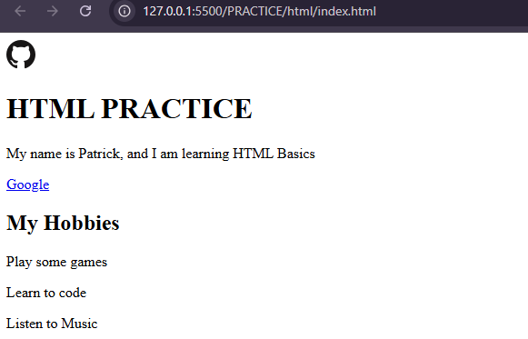

# LESSON 2.1: HTML BASICS — ACTIVITIES

## [x] ACTIVITY 1: Create the HTML Skeleton
*Create `PRACTICE/html/index.html` with basic skeleton*

```html
<!-- Your HTML skeleton here -->
 <!-- ACTIVITY 1 -->
<!DOCTYPE html>
<html lang="en">

<head>
    <meta charset="UTF-8">
    <meta name="viewport" content="width=device-width, initial-scale=1.0">
    <link rel="stylesheet" href="https://cdnjs.cloudflare.com/ajax/libs/font-awesome/4.7.0/css/font-awesome.min.css">
    <title>PRACTICE</title>
</head>

<body>
    <!-- ACTIVITY 2 & 3 -->
    <div class="header">
        <!-- image for github -->
        
        <h1>HTML PRACTICE</h1>
        <p>My name is Patrick, and I am learning HTML Basics</p>
        <a href="https://google.com">Google</a>
    </div>

    <!-- ACTIVITY 4 & 5 -->
    <div id="main-section">
        <h2>My Hobbies</h2>
        <p class="intro-text">Play some games</p>
        <p class="intro-text">Learn to code</p>
        <p class="intro-text">Listen to Music</p>
    </div>
</body>

</html>
```

---

## [x] ACTIVITY 2: Add Content
*Add heading, paragraph, and link to your HTML*

**Content Added:**
- H1 Heading: "HTML PRACTICE"
- Paragraph text: "My name is Patrick, and I am learning HTML Basics"
- Link to: https://google.com

---

## [x] ACTIVITY 3: Add an Image
*Add an  tag with src and alt attributes*

**Image URL used:** https://github.com/favicon.ico

**Alt text:** GitHub

---

## [x] ACTIVITY 4: Create a Card Layout
*Create a <div> with <h2> and three <p> tags*

**Card content:**
- H2: "My Hobbies"
- P1: "Play some games"
- P2: "Learn to code"
- P3: "Listen to Music"

---

## [x] ACTIVITY 5: Add Attributes
*Add id="main-section" to div and class="intro-text" to paragraphs*

**Verification:**
- [x] id="main-section" added to div
- [x] class="intro-text" added to all three paragraphs

---

## [x] ACTIVITY 6: Test in Browser
*Open index.html in browser and take screenshot*

**Screenshot or description:**


**What displays correctly:**
- [x] Heading visible
- [x] Paragraphs with spacing
- [x] Link is blue and clickable
- [x] Image displays
- [x] All content visible

---

## [x] ACTIVITY 7: Reflection

### 1. What did you learn?
Describe the HTML tags you used and what they do:
I learned the basics of HTML skeleton where tags are important to organize and make the html working. The tags that i used are:
TAGS
`div` - division in which acts as a container
`img` - tag for visually putting an image
`h1` - a primary header used for title and such 
`p` - a paragraph that is for long texts
`a` - anchor in which acts as a clickable text like hyperlink
`h2` - a secondary header used for sub header titles
`link` - mainly used on <head>. it allows users to link other resources

ATTS
`rel` - this is `relationship` of a linked document to the current document. 
`href` - `href` acts as a url of the linked resource.
`style` - `style` is a css styling declarations mainly used to style the layout of a tag.
`src` - `source` is the image of the url.
`alt` - `alternative` defines the image in a alternative text description
`class` - `class` allows css and js to be selected and to access specific elements via the class selectors/functions.
`id` - `identifier` is a unique name and must always be unique when set.

### 2. What is an id vs a class?
Explain the difference in your own words:
`id` is a unique set of names used to differentiate tags/elements to have their own functionalities.
`class` can be used for multiple html tags/elements.

### 3. Why do we need alt text on images?
`ALT` is a way to provide text description to an image. this is essential for accessibility and user experience.

### 4. What's the difference between a div and a span?
`div`  is a block-level element. It is a container for elements
`span` is an inline-level element. Can be use to change specific part of that elements inside container.
    
---

## 📋 Checklist
- [x] All activities completed
- [x] HTML file created and tested
- [x] Screenshot taken
- [x] Reflection questions answered

---