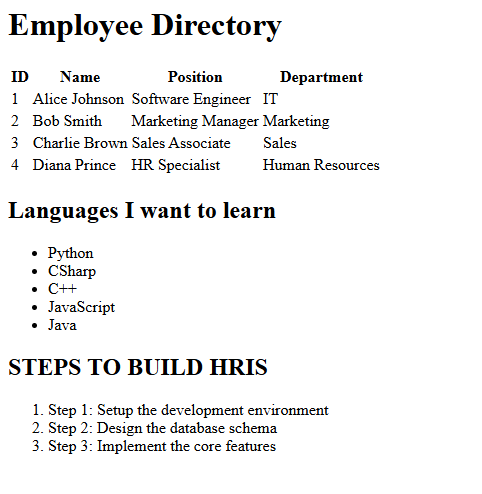

# Lesson 2.2: HTML Lists & Tables — Answer Sheet

---

## Activity 1: Create `table.html`

**Checklist:**
- [x] Created `table.html` file in `PRACTICE/html/`
- [x] Proper HTML5 structure (`<!DOCTYPE>`, `<html>`, `<head>`, `<body>`)
- [x] Has a heading: "Employee Directory" (or similar)
- [x] Table has 4 columns: Employee ID, Name, Department, Position
- [x] `<thead>` section with headers
- [x] All `<th>` headers have `scope="col"` attribute
- [x] `<tbody>` section with 3+ employee rows
- [x] All `<td>` cells contain placeholder data
- [x] Proper indentation and formatting

**Notes:**
I have struggled on understanding and reading tables and lists on html before because its too messy to read. but since im learning it as a hobby, its now getting clear for me.

---

## Activity 2: Create a Bullet List

**Checklist:**
- [x] Added `<h2>` heading: "Languages I Want to Learn"
- [x] Used `<ul>` tag for unordered list
- [x] Added exactly 5 `<li>` items with programming languages
- [x] List appears as bullets in browser

**Languages Listed:**
1. Python
2. CSharp
3. C++
4. JavaScript
5. Java

---

## Activity 3: Create a Numbered List

**Checklist:**
- [x] Added `<h2>` heading: "Steps to Build HRIS" (or similar)
- [x] Used `<ol>` tag for ordered list
- [x] Added exactly 3 `<li>` items with HRIS steps
- [x] List appears as numbers in browser
- [x] Steps written from memory (didn't look at docs)

**Steps Listed:**
1. Step 1: Setup the development environment
2. Step 2: Design the database schema
3. Step 3: Implement the core features

---

## Activity 4: Combine Everything

**Checklist:**
- [x] File `PRACTICE/html/table.html` contains all content below
- [x] Main heading: "HTML Lists & Tables Practice"
- [x] Table from Activity 1 included with 4 columns and 3+ rows
- [x] Bullet list from Activity 2 included
- [x] Numbered list from Activity 3 included
- [x] Proper HTML comments added (e.g., `<!-- Table Section -->`)
- [x] Proper indentation throughout
- [x] All code is organized and readable

---

## Activity 5: Test in Browser

**Checklist:**
- [x] Opened `table.html` in browser (double-click or right-click > Open With)
- [x] Table displays correctly with all 4 columns
- [x] Table has all rows visible and readable
- [x] Bullet list displays with bullet points (•)
- [x] Numbered list displays with numbers (1, 2, 3)
- [x] All text is visible and properly formatted
- [x] No broken elements or layout issues
- [x] Took a screenshot of the result

**Browser Test Result:**

---

## Activity 6: Reflection Questions

Answer these questions based on what you learned in Lesson 2.2:

### **1. What is the difference between `<ul>` and `<ol>`?**

Your Answer:
`ul` is a unordered list which means there is no order compared to `ol` that list elements with rankings or numbers
---

### **2. Why do we use `<thead>` and `<tbody>` in tables?**

Your Answer:
they are both important because they offer standard outlines and accessibity for users to read. they organize the tables to make it easier for us to read.
---

### **3. What tag do you use for header cells in a table?** (`<th>` or `<td>`?)

Your Answer:
i have used th since its the normal way of using header cells and more common. it is also serve an easy way to understand the tables
---

### **4. Can you nest a list inside another list?** (Yes/No and why?)

Your Answer:
yes, we can nest multiple lists inside another list because they are created to form a list items, elements, and other useful things.

---

### **5. When would you use a table vs a list?** (Example: when to use each)

Your Answer:
`tables` are used to visualize properties and organize them. we can use this for employees, data, and other important things.
`list` are used to basically list sentences, steps, and other listable things that are according to design. we can use this for listing shopping items, rankings, leaderboards, and other text related things.

---

---

## ✅ Overall Completion Checklist

Review all activities before moving to Lesson 2.3:

**Activities 1-5 (Hands-on):**
- [x] Activity 1: `table.html` created with proper structure
- [x] Activity 2: Bullet list with 5 languages added
- [x] Activity 3: Numbered list with 3 HRIS steps added
- [x] Activity 4: All content combined in single `table.html` file
- [x] Activity 5: File tested in browser and works correctly

**Activity 6 (Reflection):**
- [x] All 5 reflection questions answered
- [x] Answers show understanding of concepts

**Overall:**
- [x] All files saved in correct locations
- [x] Code is properly formatted and indented
- [x] Ready to move to Lesson 2.3 (HTML Forms)
