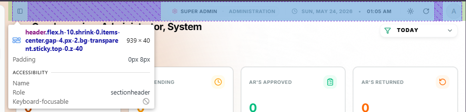
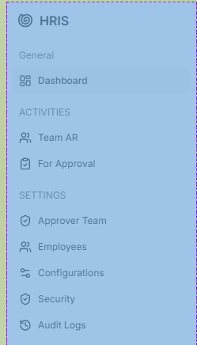
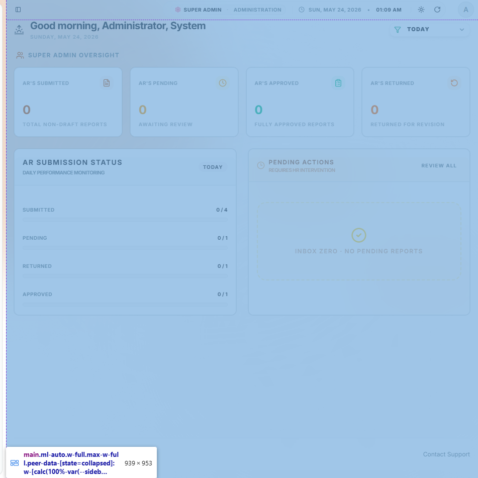
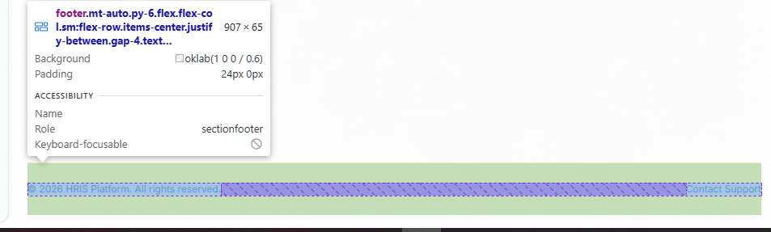
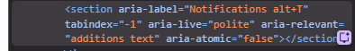

# Lesson 2.4: Semantic HTML — Answer Sheet

---

## Activity 1: Restructure `index.html`

**Checklist:**
- [x] Opened `index.html` from Lesson 2.1
- [x] Added `<header>` with title
- [x] Added `<nav>` with links (Home, About, Contact)
- [x] Wrapped content in `<main>`
- [x] Added `<footer>` with copyright
- [x] Removed unnecessary `
` wrappers
- [x] File saved and tested in browser

**Changes Made:**
(Describe what semantic tags you added and how the structure looks now)
- the semantic tags i used are
    header - to highlight the header of the page
    nav - to access my navs 
    main - replaced div with main tag to have it properly structured
    footer - added footer in order to add formality

---

## Activity 2: Create `blog.html`

**Checklist:**
- [x] Created `blog.html` in `PRACTICE/html/`
- [x] Has `<header>` with blog title and `<nav>`
- [x] `<main>` contains one `<article>`
- [x] Article has:
  - [x] Title (`<h2>`)
  - [x] Date (using `<time>` tag with datetime attribute)
  - [x] Blog post content
- [x] Has `<footer>` with copyright
- [x] Proper semantic nesting
- [x] File tested in browser

**Blog Post Title:**
(What did you write about?)
- I write a simple blog text for introduction
**Date Format Used:**
(Show your `<time>` tag example)
- I used <time datetime="2026-05-24">May 24, 2026</time>
**Notes:**
(Any challenges or observations?)
- None, since it became easy for me because it's techincally just reconstructing it properly.
---

## Activity 3: Restructure `table.html`

**Checklist:**
- [x] Opened `table.html` from Lesson 2.2
- [x] Added `<header>` with page title
- [x] Wrapped table in `<main>` → `<section>`
- [x] Added heading to section
- [x] Wrapped lists in `<section>` tags
- [x] Added `<footer>` with notes
- [x] File saved and tested in browser

**Sections Added:**
- Section 1 (Table): Employee Directory
- Section 2 (Languages): Programming Languages
- Section 3 (Steps): HRIS Setup Steps

---

## Activity 4: Restructure `login.html`

**Checklist:**
- [x] Opened `login.html` from Lesson 2.3
- [x] Added `<header>` with site title and description
- [x] Wrapped form in `<main>` → `<section>`
- [x] Section has heading (e.g., "Login")
- [x] Form structure remains intact
- [x] All form elements still work the same
- [x] Added `<footer>` with copyright
- [x] File saved and tested in browser

**Header Content:**
(What did you put in the header?)
- i have put my title and navigations just like in the other pages.

**Notes:**
(Did the semantic structure change how the form looks or works?)
- it didn't because divs and semantic tags are basically similar but semantics are more important when we are talking about accessibility and structure.

---

## Activity 5: Analyze Real HRIS Website Structure

**Checklist:**
- [x] Opened HRIS at `http://localhost:3000`
- [x] Opened DevTools (F12 or right-click → Inspect)
- [x] Located `<header>` tag
- [x] Located `<nav>` tag
- [x] Located `<main>` tag
- [x] Located `<footer>` tag
- [x] Searched for `<section>` and `<article>`
- [x] Took screenshots

**HRIS Structure Findings:**
`Login as Admin`
**`<header>` contents:**
(What's in the HRIS header? Logo? Navigation? Title?)
- the `header` consists of button for sidebar close, role and department, time and date, night mode and refresh, user's profile button

**`<nav>` contents:**
(What navigation does HRIS have? Main menu? User menu?)
- the `nav` of the hris is sitting inside a sidebar in which held by `sidebar-content`.

**`<main>` location:**
(Where is the main content? What does it contain?)
- the content of the main is depending on the user's navigation but for trial, it contains various in dashboard.

**`<footer>` contents:**
(What's in the footer? Copyright? Links? Contact info?)
- the content of the `footer` is the copyright and contact support navigation

**Other semantic tags found:**
(Any `<section>`, `<article>`, `<aside>`? Where are they?)
- i found one section which is from notification button but it's not visually enabled since we have disabled it.

**Observations:**
(What surprised you about the HRIS structure? How is it similar/different from your files?)
- it suprised me because of how complex it is. but either way, it still uses div. it has similarities for how we handle containers but the difference is that the HRIS is more broad and more functionalities.
---

## Activity 6: Validate HTML with W3C Validator

**Checklist:**
- [x] Validated `index.html` on W3C
- [x] Validated `blog.html`
- [x] Validated `table.html`
- [x] Validated `login.html`
- [x] Fixed any errors found
- [x] Documented results

**Validation Results:**

**index.html:**
- Errors: ___
- Warnings: ___
- Status: ✅ Valid / ❌ Needs Fixes
  - Document checking completed. No errors or warnings to show.

**blog.html:**
- Errors: ___
- Warnings: ___
- Status: ✅ Valid / ❌ Needs Fixes
  - Document checking completed. No errors or warnings to show.

**table.html:**
- Errors: ___
- Warnings: ___
- Status: ✅ Valid / ❌ Needs Fixes
  - Document checking completed. No errors or warnings to show.

**login.html:**
- Errors: ___
- Warnings: ___
- Status: ✅ Valid / ❌ Needs Fixes
  - Document checking completed. No errors or warnings to show.

**Errors Fixed:**
(What errors did you encounter? What did you do to fix them? What did you learn?)

1. Warning: Section lacks heading. Consider using h2-h6 elements to add identifying headings to all sections, or else use a div element instead for any cases where no heading is needed.
  FIX: I replaced section radioRoles into div

2. Error: The value of the for attribute of the label element must be the ID of a non-hidden form control.
  FIX: the misleading id routes are fix.

3. Error: Element time not allowed as child of element time in this context. (Suppressing further errors from this subtree.)
  FIX: the extra <time> was removed

---

## Reflection Questions

Answer these based on Lesson 2.4 and your activities:

### **1. How did restructuring your old HTML files with semantic tags change the appearance in the browser?**

Your Answer:
- It did not really change the appearance rather it changed how accessible the page is in case of debugging.
---

### **2. Why would a developer use W3C Validator? What's the benefit of validating your HTML?**

Your Answer:
- It did help me find some errors and warning that the text editor (VS Code) cannot see. It is important because it does help the html page to be properly structured.
---

### **3. Looking at the real HRIS code, how is it similar to or different from your structured HTML?**

Your Answer:
It has similarities in terms of semantic tags usage but the difference are that HRIS is more complex and well structured compared to my practice HTMLS.
---

### **4. What would happen if you didn't use semantic HTML and used only `
` tags instead? Why would that be a problem?**

Your Answer:
- I learned that semantic tags makes the page more readable inside its code since it reduce the unknown usage that the other properties use. If i did not use semantic and instead used div, the system might not read it as intended and break the system in a long run.
---

### **5. For your future projects, will you use semantic HTML? Why or why not?**

Your Answer:
- I would use semantic HTMl in order to properly organize and structure my page because it is the developer's duty to make his or her programming to be readable to make it to the market
---

---

## ✅ Overall Completion Checklist

Before moving to Unit 3 (CSS):

**Activities 1-6 (Hands-on):**
- [x] Activity 1: Restructured `index.html` with semantic tags
- [x] Activity 2: Created `blog.html` with semantic structure
- [x] Activity 3: Restructured `table.html`
- [x] Activity 4: Restructured `login.html` (combined with registration)
- [x] Activity 5: Analyzed real HRIS website structure
- [x] Activity 6: Validated all HTML files with W3C

**Reflection:**
- [x] All 5 reflection questions answered
- [x] Answers show deep understanding of semantic concepts

**Overall:**
- [x] All files saved in `PRACTICE/html/`
- [x] All files pass W3C Validation (with fixes applied)
- [x] Code properly formatted and indented
- [x] Understand WHY semantic HTML matters
- [x] Ready to move to Unit 3: CSS Fundamentals ✅

---

## 🎯 Key Concepts You Mastered

✅ What semantic HTML is and why it matters  
✅ When to use each of the 7 semantic tags  
✅ How semantic tags improve SEO and accessibility  
✅ How to validate HTML with W3C Validator  
✅ Real-world examples from your HRIS project  

**Congratulations!** You've completed Unit 2 (HTML Fundamentals). Next up: Unit 3 (CSS) to style your semantic HTML!
