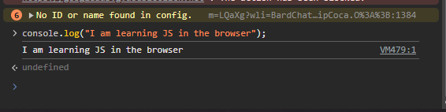

## 🧪 Test Checklist
STEP 1 - 3:
```js
// 1. variables
let name = "Patrick";
let age = 22;
let isStudent = false;
let favoriteFoods = ["Burger", "Pizza", "Chicken"];
let person = {
    firstName: "Patrick",
    jobTitle: "Unemployed"
};


// 2. Functions
const sayHello = (name) => {
    return `Welcome to JS, ${name}!`
}
console.log(sayHello("Patrick"));

// 3. If/Else
if (age => 18) {
    console.log("You can vote!");
} else {
    console.log("Too young to vote!")
}

// 4. For Loop
for (let i = 0; i < favoriteFoods.length; i++) {
    console.log(favoriteFoods[i]);
}
// 5. Map
function newFavFood() {
    return favoriteFoods.map((food) => {
        return food + " is delicious!"
    });
}
console.log(newFavFood());
```
STEP 4:


- [x] `PRACTICE/js/basics.js` created and runs without errors
- [x] Variables (string, number, boolean, array, object) correctly declared
- [x] Arrow function created and tested
- [x] `if/else` logic works
- [x] `for` loop prints array items
- [x] `.map()` successfully transforms the array
- [x] Ran the file using `node basics.js` in the terminal
- [x] Executed `console.log` in the Chrome Developer Tools Console

---

## 📊 Final Score: 10/10

**Summary:**
- [x] Activity completed (`basics.js` built and run)
- [x] All 8 checklist items pass
- [x] Browser console screenshot saved

**Ready for:** Lesson 4.2 — TypeScript Basics
