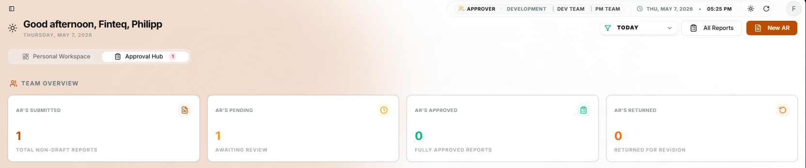
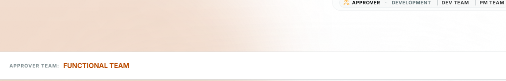

<!-- PROMPT: i told you before that you should just give me an insstruction and procedure to do the things and let me do the code. but since im a beginner i need your guide what code i should put. it should also be explained to me. -->

# Accomplishment Report (AR) Implementation Tasks

## Phase 1: Update the Database Model (State Tracking)
Right now, the `AccomplishmentReport` model only holds the task details. In the real world, reports need an approval workflow.

**Tasks:**
1. Open `backend/Models/AccomplishmentReport.cs`.
2. Add a `Status` property to define the state of the AR (e.g., Pending, Approved, Rejected):
   ```csharp
   public string Status { get; set; } = "Pending";
   ```
3. *(Optional)* Add a `DateSubmitted` or `CreatedAt` timestamp. 
4. Open the terminal, navigate to the `backend` folder, and apply the database changes:
   ```powershell
   dotnet ef migrations add AddStatusToAR
   dotnet ef database update
   ```

## Phase 2: Enhance the Service Layer (Role-Based Access)
Right now, the service only fetches records for the exact user token. We need to introduce the same Role-Based Access Control (RBAC) logic used in `EmployeeService`.

**Tasks:**
1. Open `backend/Services/AccomplishmentReportService.cs` and inject the `UserManager<ApplicationUser>` alongside your `ApplicationDbContext`.
2. Add a new method to `IAccomplishmentReportService` and its implementation: 
   ```csharp
   public async Task<IEnumerable<object>> GetAllReportsAsync(string currentUserId)
   ```
3. **The Logic Blueprint for `GetAllReportsAsync`:**
   * Find the user using `_userManager.FindByIdAsync(currentUserId)`.
   * Get their roles using `_userManager.GetRolesAsync(user)`.
   * **If SuperAdmin**: Return all ARs from `_db.AccomplishmentReports`.
   * **If Manager/Admin**: Join the `AccomplishmentReports` with `AspNetUsers` and filter where the user's `Department` matches the manager's `Department`.
   * **Else (Standard Employee)**: Return only the reports where `UserId == currentUserId`.
   * *Tip:* Return them as an anonymous object or DTO so you can include the employee's `FullName` alongside the report data for the frontend!

## Phase 3: Update the Controller (New Endpoints & Security)
Now expose the new logic to the frontend and manage the AR lifecycle securely.

**Tasks:**
1. Open `backend/Controllers/AccomplishmentReportsController.cs`.
2. Update the base `[HttpGet]` method to call your new `GetAllReportsAsync()` method instead of the strict `GetByUserAsync()`.
3. Add a **new endpoint** for Approvals:
   ```csharp
   [HttpPut("{id}/status")]
   public async Task<IActionResult> UpdateStatus(int id, [FromBody] UpdateStatusDto dto)
   ```
   * This endpoint should take a new DTO (e.g., containing `"Approved"` or `"Rejected"`).
   * Check if the logged-in user is a Manager or SuperAdmin before allowing this action (Standard users should NEVER approve their own ARs).
4. Update the `[HttpPut("{id}")]` and `[HttpDelete("{id}")]` methods. Right now, they block anyone who isn't the owner.
   * *New Logic*: Standard users can only edit/delete their AR if the Status is exactly `"Pending"`. SuperAdmins/Managers can edit/delete them at any time.

## Phase 4: Frontend Integration
Once the backend logic is solid, we need to bridge the gap to the UI.

**Detailed Tasks:**
1. **DataProvider Refinement:** 
   * Open `hris/src/dataProvider.ts`.
   * Ensure it correctly parses the `ApiResponse<T>` wrapper and handles the raw array returned by `GetAllReportsAsync`.
2. **Resource Definition:** 
   * Open `hris/src/App.tsx`.
   * Register the `AccomplishmentReports` resource.
   * Define custom `List`, `Create`, and `Edit` components to replace the default guessers.
3. **Approval UI (Admin Feature):**
   * Create a custom `StatusBadge` component using `Badge` from shadcn/ui to color-code statuses: 
     * **Pending** (Yellow) | **Approved** (Green) | **Returned** (Orange).
   * Create an `ApproveButton` and `RejectButton` that only appear for **Admin/SuperAdmin** users on pending reports.
   * Add an Admin AR Review page that is based on the Employee AR list UI, but applies review-level limitations (Admin sees reports with scoped permissions and can only act inside their review boundary).
4. **Conditional Permissions:**
   * Disable the `Edit` and `Delete` buttons for **Employee** users if the report status is already "Approved" or "Rejected".
5. **Data Visualization:**
   * Map the extra data returned by the backend (like `FullName` or `CreatedAt`) into the `Datagrid` so Managers know exactly whose report they are looking at.

## Testing Guide: Employee AR Dashboard
To ensure the foundational Employee AR features are working smoothly before introducing Claims, run through this checklist:
1. **Login as Employee:** Start the frontend and backend, then log into the web portal using a standard employee account.
2. **Submit a New Report:** Go to "My ARs" -> "New AR". Fill out a realistic task in the table and click Submit. You should see a clean notification toast (no ugly browser alerts) and be redirected to the list.
3. **Verify Dashboard:** Look at the "My ARs" table. It should display your fresh report with accurate calculated hours and a "PENDING" badge. (Make sure you don't see any old hard-coded mock data).
4. **Test Pending Actions:** Try clicking on the report to View/Edit it, and then try Deleting it. Because it is "Pending", the system should allow you to delete it (which will safely tuck it away into your `DeletedAccomplishmentReports` archive table in Postgres).
5. **Test Status Locks:** Submit one more AR. Open **pgAdmin 4** and manually change its `Status` to `"Approved"`. Go back to your employee UI and try to delete it. The backend should reject the deletion because standard employees cannot delete approved reports!

   <!-- NEW FEATURES TO BE ADDED: Viewer/Approver claim management and EM viewer dashboard -->

   ## Phase 5: Claim-Based Role Management (Viewer / Approver)
   Instead of creating many complex roles, we will use ASP.NET Core Identity Claims (`AspNetUserClaims` table) to grant specific permissions to standard Employees.
   
   **Hierarchy:**
   - **ADMIN / SUPERADMIN**: Full access.
   - **EMPLOYEE**: Base access. Can be granted specific *Claims* (e.g., `Viewer` or `Approver`).

   **How it works (Examples):**
   - Employee Joren is granted the `Viewer` claim by an Admin. Joren can now see other employees' ARs in the same department.
   - Employee Marie is granted the `Approver` claim by an Admin. Marie can approve or reject pending ARs.
   - Employee Patrick has no claims. He can only view and create his own ARs.

   **Implementation Tasks:**
   1. **Backend - Assign Claims Endpoint**: Create endpoints in an Admin/Auth Controller for Admins to assign/remove the `Viewer` and `Approver` claims using `_userManager.AddClaimAsync()`.
   2. **Backend - Authorization Policy**: In `Program.cs`, add authorization policies: `CanViewARReview` for `Viewer` and `CanApproveAR` for `Approver`.
   3. **Backend - Controller Updates**: Update `AccomplishmentReportsController` endpoints to allow users who are `Admin` OR `Viewer`/`Approver` as appropriate.
   4. **Frontend - Claim Payload**: Ensure the backend includes the user's claims in the returned connection payload (login/auth response).
   5. **Frontend - UI Validation**: Read the claims in the React auth provider to conditionally display the "AR Review" screens and actions.
   6. **Frontend - Supervisor Dropdown**: When creating an AR, the "Supervisor" dropdown must only list users who have the `Viewer` claim OR are Admins.

   **APPROVED BY COLUMN**
   - In the AR List, add an "Approved By" column next to the Date to show the Name/ID of the user who approved the report.

   ## Phase 6: EM: Viewer Dashboard
   This dashboard is for employees who have the `Viewer` claim and need to review other users' accomplishment reports.

   **Dashboard Tasks:**
   1. Add a new sidebar link under `Reports` labeled `EM: Viewer Dashboard`, placed immediately after `My Workspace`.
   2. Make the new dashboard visible only to users who have the `Viewer` claim or are `Admin`/`SuperAdmin`.
   3. Show other employees' accomplishment reports in this dashboard.
   4. Reuse the existing approval actions for approvers on pending reports.
   5. Ensure standard employees cannot access this dashboard.

   <!-- PRIO CHANGES FOR AR LIST -->
   1. 
   FILTERING AND SEARCH BAR FOR ACCOMPLISHMENT REPORT =  
   ADMIN ONLY = FILTER FEATURE FOR DEPARTMENT, PENDING, APPROVED, REJECTED, DATE (MONTH, DAY, YEAR, TIME)
              = THIS FILTER IS ALSO CONNECTED TO THE SEARCH BAR WHICH ALSO SEARCH THE FOLLOWING FILTERS
   EMPLOYEE & ADMIN = SAME AS ADMIN BUT WITH LIMITATION TO DEPARTMENT, SINCE NORMAL EMPLOYEE WILL NOT SEE OTHER ARs only himself/herself.
   2. ADMIN: AR REPORT REVIEW SHOULD BE MODIFIED
      -- SAME AS EMPLOYEE's AR LIST BUT WITH LIMITATIONS
         -- ADMIN AR REVIEW LIST SHOULD LIST: AR REPORTS SUBMITTED ONLY, AR CAN VIEW AR REPORTS, AR CAN BE APPROVED/REJECT AND GIVE FEEDBACK (WILL ALSO REFLECT TO THE USER'S DASHBOARD)
      -- SEARCH AND FILTER MUST BE IMPLEMENTED IN ADMIN AR REVIEW LIST (SAME SEARCH METHOD IN EMPLOYEE | FILTER MUST HAVE REPORT STATUS; REVIEW STATUS; DATE; ID; DEPARTMENT; POSITION)
      -- REMOVE THE "Items" COLUMN
      -- LISTING SHOULD BE THE SAME AS THE EMPLOYEE: 1 REPORT; 2 TASKS INSIDE THAT REPORT
   3. WITH CLAIM-BASED: AR REPORT LIST SHOULD BE THE SAME AS THE ADMIN BUT WITH LIMITS
      EM: VIEWER:
      -- AR REVIEW WILL LIST THE REPORTS OF OTHER USERS BUT EXCLUDING THEIR OWN REPORTS:
         -- EXAMPLE: EM: VIEWER JOREN CAN SEE EM: VIEWER JC REPORT; HENCE JC CANNOT SEE HIS OWN REPORT ON THE AR LIST FOR ALL USERS
         --  
   4. REVISE THE AR REVIEW FLOW:
      IMPORTANT: THE ROLE BASED WILL NOW BE REPLACED
      -- EMPLOYEE CAN SET THE SUPERVISOR/VIEWER INSIDE CREATE AR (JUST LIKE EMAIL BASED: RECIPIENT + CC)
         - THAT EMPLOYEE CAN CHOOSE WHICH EMPLOYEE WILL REVIEW THEIR REPORT
         - EXAMPLE: PATRICK SETS ARLAN + HR ACC
         - ARLAN WILL NOW HAVE ANOTHER BUTTON IN SIDEBAR WHERE THEY CAN SEE THE REPORTS SENT TO HIM WHICH IS THE "AR REVIEWS"
         - 
<!-- EDIT PAGE OF EMPLOYEE AR -->
-- BUGS --
- [x] CAN STILL EDIT EVEN IF APPROVED STATUS (Fixed on frontend via action guards and backend status checks)
- [x] UI Crash on breaking points when combining MUI and Shadcn (Fixed using local `@/components` wrappers instead of `react-admin` direct imports)
- [x] Deletion bounce-back in UI (Fixed using `mutationMode="pessimistic"`)
- [x] Unifying ARCreate and AREdit pages to use exact same tabular UI (Completed)

<SUPERVISOR SUGGESTIONS>
- cloud-based ready to maintain the software turnover
- historical value of the dashboard where boxes can be clicked to show data or redirect to that dashboard
- avg rating: turn into KPI = compliance (late, no late) computation based on default based with submission
- avg rating: total pending + total approved
- kpi dashboard: compliance report (on time submissions, late submissions)
- setting of hris: assigning of remote phase of the employees
   -- ex: remotes: setup time and schedule
   -- must be flexible: admin can add the remote setup (can add additional remote day(s))
- keep today's progress: will based on hours in the tasks row
- activity timeline: inside AR
- inbox - notification: existing email
- setup: email of the employee will be notified when submitted
- required fields in create AR
- switch to claim-based instead of email type
- accessible AR for approver and viewer only
-- employee setup
   -- employee        - can only view self reports
   -- team lead       - can only viewed what to approved to him
   -- management team (not hardcoded | can have additions) - can approve team lead/employee/manage team
   <MANAGEMENT ACC>
- avg team rating - removed
- total ARS = replace the TOTAL EMPLOYEES
- same as dashboard of employee
- ADD EMPLOYEE =(IN ADMIN ACCOUNT TOO)
- MANAGEMENT TEAM: PART OF ADMIN
   <!-- -- PERMISSIONS: CREATOR PERMISSION -->
   -- EMPLOYEE: CAN CREATE REPORT
   -- APPROVER: CREATE AND APPROVE (TEAM LEAD 1)
   -- ADMIN ONLY: CREATE/APPROVE/ACCESS USER MANAGEMENT
   -- VIEWER: VIEW OF REPORTS ONLY (TEAM LEAD 2)
----------------------------------------------------------------------------------------------
<REFINED SUPERVISOR SUGGESTIONS>
- Cloud-ready architecture
   - Ensure the HRIS app can be deployed and maintained in a cloud environment.
   - Support zero-downtime updates and easy handoff to operations.
- Dashboard should support interactive data cards
   - Each dashboard box should be clickable to navigate to a related report or detail page.
   - Include summary cards that link to filtered AR lists or KPI pages.
- KPI: Compliance by submission timing
   - Track on-time vs late AR submissions.
   - Display a compliance score or ratio instead of a simple average rating.
- KPI: Report status summary
   - Show counts for Pending, Approved, and Rejected ARs.
   - Use these values as a dashboard metric instead of a generic average rating.
- KPI dashboard should include compliance reports
   - Include charts or cards for on-time submissions, late submissions, and approval turnaround.
- Remote work configuration
   - Add a flexible HRIS setting for remote work phases and schedules.
   - Allow admins to create and modify remote setup options (e.g. remote days, shift windows).
- Daily progress tracking in AR
   - Show today's progress based on the total hours logged in each AR task row.
   - Use calculations from StartTime/EndTime to show hours worked.
- Activity timeline inside AR
   - Add an activity history or timeline to each accomplishment report.
   - Include status changes, approvals, rejections, and comments.
- Notification inbox and email alerts
   - Add an inbox or notification center for AR submissions.
   - Send email notifications to employees when their AR is submitted, approved, or rejected.
- Required fields for AR creation
   - Make key fields mandatory in the AR create form: client, task name, start time, end time, status, and viewer/supervisor.
- Move from email-based viewer assignment to claims-based permissions
   - Use claims for approvals/reviews instead of only email addresses.
   - This supports flexible viewer roles and avoids hardcoding emailed assignments.
- Access control for approvers and viewers only
   - Ensure only approvers/viewers see the AR approval/review pages.
   - Standard employees should only see their own reports.
- Role definitions and permissions
   - Employee: create reports only.
   - Approver: create and approve reports (team lead role).
   - Admin: full access, including user management and approvals. admins can also set roles
   - Viewer: view reports only.
- Replace “Total Employees” with “Total ARs” on dashboard
   - Use AR-specific metrics in the report dashboard.
- Keep employee and admin dashboard behavior aligned
   - Both dashboards should use similar visuals, with admin having more filtering and visibility.
- Add employee management within admin
   - Admin accounts must be able to add and manage employees from the same interface.
- Management team should be part of Admin role
   - Treat the management team as a subset of admin-level permissions with report oversight.

<REFINED TASK NOTES>
- Add a “Viewer” claim-based permission to the system and add a separate “Approver” claim where needed.
- Ensure AR approval workflows are visible only to approvers and admins.
- Add an “Approved By” column to AR lists.
- Keep AR creation fields required and validate on backend.
- Add dashboard KPIs for compliance, on-time submissions, and total pending/approved ARs.
- Provide a clear separation between employee-only views and manager/admin review views.

<DONE>
- ACCOMPLISHMENT BACKEND AND FRONTEND 
   -- ROWS PER PAGE FOR EMPLOYEE
   -- CANCEL BUTTON IN CASE OF BAD SUBMISSION
   -- FILTERING VIA COLUMN
   -- FRONT END POSITIONING FOR NEW AR & EDIT MENU
   -- REMOVED PARTICULARS AND CHANGE BY TASKS
   -- FIX REVIEW MENU FRONT END AND BACKEND
   -- ADDED TIME FOR REVIEW MENU
-- FLAWS
   -- ROWS PER PAGE: 5 suddenly changes LIST DESIGN in AR LIST because of button being removed when filtered
   -- BUTTON SIZES FOR AR LISTS IS NOT MATCH

   TASKS (CHECKED | UNCHECKED): APR 22/04/26
- IMPLEMENT ROLES & CLAIMS: 
   -- ADMIN CHANGE TO HR MANAGEMENT (roles)
   -- VIEWEER (DONE) (claims)
   -- APPROVER (claims)
   -- CREATOR (REGULAR EMPLOYEE) (roles)
   -- ROLES ACCOUNT CONFIGURATION
- FEEDBACK MESSAGE VIEWER FOR RETURNED REPORTS 


- TASKS (23/04/26): 
   -- SETUP THE ROLES AND CLAIMS
   -- DROPDOWN IN TEAM DASHBOARD IN ADMIN under the ROLE (should be replaced as CLAIM) Column should be: EM: Viewer & EM: Review only because its a claim
   -- DEFAULT USER creation should be: USER or ADMIN (replace "manager" label into "admin") this is where the roles.
   -- A certain user without claims should have a setup supervisor 
      -- this means that the current user (with approver claim) is a default supervisor; meaning to say the regular user reports will be automatically list in approver dashboard
   


---

## TASKS — 24/04/26

> **Execution Order:** Phase A → B → C → D (each phase depends on the one before it)

---

### Phase A: Create Member Form — Data Foundation
> **Do this first.** FullName structure affects how names appear everywhere: Team table, Dashboard, Profile page, and AR review panels.

**Frontend — `Team.tsx` (Add Member Dialog)**
1. Split the single "Full Name" `<Input>` into **4 separate fields**:
   - `Surname` (required)
   - `First Name` (required)
   - `Middle Name` (required)
   - `Suffix` (optional — e.g. Jr., III)
   - Compose them into a single `fullName` string before sending to the API: `"${surname}, ${firstName} ${middleName} ${suffix}".trim()`
2. Add **show/hide toggle** to the Initial Password field using an eye icon (`Eye` / `EyeOff` from lucide-react) and toggling `type="password"` ↔ `type="text"`.
3. Change **Position** field from `<Input>` to a **searchable combobox/select** with preset options:
   - Marketing, IT, Accounting *(expandable)*
4. Change **Department** field from `<Input>` to a **dropdown** with options:
   - Functional, Developer
5. Mark all fields as **required** in HTML and add frontend validation before submit — **except Suffix**.

**Backend — `CreateEmployeeDto.cs`**
- No structural changes needed. The `UserName` field will receive the composed full name string from the frontend.
- Ensure `Position` and `Department` remain `string?` — no enum enforcement needed at backend level.

---

### Phase B: Admin Team Page — Role Column Cleanup
> **Do this second.** Clarifies the Employee/Admin role distinction before the dashboard interprets role-based data.

**Frontend — `Team.tsx` (RoleCell component)**
1. In the `<RoleCell>` dropdown, remove the `Viewer` and `Approver` options.
   - These are now handled exclusively by the **Permissions column** (`PermissionModal`).
   - The Role dropdown should only contain: **Employee** and **Admin (HR Management)**.
2. Update the label from `"Manager"` to `"Admin"` anywhere it still appears in the dropdown.

---

### Phase C: Admin Dashboard — Stats & Panels
> **Do this third.** Depends on clean member data from Phase A and correct role setup from Phase B.

**Frontend — `EmployerDashboard.tsx`**

#### Stat Boxes (already computed — label corrections only):
1. **Box 1** → Label: `"AR's Submitted"` — value: all ARs where `status !== 'Draft'` ✅ (already `submittedArs`)
2. **Box 2** → Label: `"AR's Pending"` — value: ARs where `status === 'Pending'` ✅ (already `pendingArs`)
3. **Box 3** → Label: `"AR's Approved"` — value: ARs where `status === 'Approved'` ✅ (already `approvedArs`)
   - Currently the third box shows `"ARs Reviewed"` (submitted minus pending). Change it to show **Approved only** using `approvedArs.length`.

#### AR Submission Status Panel:
- Verify the progress bars reflect live data (Submitted / Reviewed / Approved) — these are already computed from `useGetList`.
- Add a **Returned** progress tracker:
  - `returnedArs = filteredArs.filter(ar => ar.status === 'Returned' || ar.status === 'Returned_Draft')`
  - Add this as a 4th progress row in the panel.

#### Pending Actions Panel:
- Currently only shows `status === 'Pending'` reports.
- Update `pendingActions` to also include **Returned** reports:
  ```ts
  const pendingAndReturnedArs = filteredArs.filter(
    ar => ar.status === 'Pending' || ar.status === 'Returned' || ar.status === 'Returned_Draft'
  );
  ```
- Add a `Status` badge column to the Pending Actions table so the admin can distinguish Pending vs Returned at a glance.

---

### Phase D: Account Settings — Edit Profile & Change Password
> **Do this last.** Self-contained feature. No other tasks depend on it.

**Backend — New Endpoints in `AuthController.cs`**
1. **Edit Profile** — `PUT /api/auth/profile`
   - Accepts: `{ fullName, position, department }`
   - Updates the currently authenticated user's fields via `_userManager.UpdateAsync(user)`.
   - Requires `[Authorize]` (any logged-in user).
2. **Change Password** — `PUT /api/auth/change-password`
   - Accepts: `{ currentPassword, newPassword }`
   - Uses `_userManager.ChangePasswordAsync(user, currentPassword, newPassword)`.
   - Requires `[Authorize]` (any logged-in user).
   - Return a clear error if `currentPassword` is wrong.

**Frontend — `ProfileShow.tsx`**
1. **Edit Profile button** → opens a `<Dialog>` with editable fields: Full Name, Phone Number, Position, Department.
   - On save: calls `PUT /api/auth/profile` via `fetch` with the Bearer token.
   - On success: refresh identity via `useGetIdentity()` refetch or page reload.
2. **Change Password button** → opens a separate `<Dialog>` with:
   - Current Password (with show/hide toggle)
   - New Password (with show/hide toggle)
   - Confirm New Password (frontend validation — must match New Password)
   - On save: calls `PUT /api/auth/change-password`.
   - On success: show a success toast and close dialog.

--- 

### Phase E: EDITOR DASHBOARD FOR ADMIN (settings)
OBJECTIVE: This menu is the configuration for admin setup.
!!! PROFILE BUTTON IN SIDEBAR WILL BE RENAMED AS SETTINGS !!!
ADMIN CAN:
 - reduce positions, change positions, add positions
 - reduce departments, change departments, add departments
 
---

### PHASE F: VIEW AND EDIT MEMBERS (FROM ADMIN's TEAMS TAB)
OBJECTIVE: To use the view and edit actions in teams tab.
ADMIN CAN:
 - EDIT MEMBERS CREDENTIALS (BY USING THE EDIT CARD/ADD MEMBER CARD. WHEN CLICK, IT SHOULD POPULATE THE FIELDS WITH THE CURRENT USER DATA AND UPON SUBMIT, IT WILL UPDATE THE USERDATA. CAN ALSO UPDATE PASSWORD.)
 - VIEW MEMBERS CREDENTIALS AND REPORTS (FLOATING CARD THAT LISTS USER'S REPORTS ALL REPORTS (EXCL. DRAFTS) AND USER CREDENTIALS IN READ ONLY. THIS ACTION SHOULD BE AVAILABLE IN THE TEAM TAB.)


---

### PHASE G: Database Refactor (1 Row per Report with JSON Array)
**ONGOING TASK (Scheduled for Tomorrow)**
OBJECTIVE: Refactor the `AccomplishmentReports` table to simplify the C# grouping logic and map directly to the frontend's concept of a report.
- **Change:** Instead of storing 1 row per task, we will store **1 row per Report** in the `AccomplishmentReports` table.
- **Implementation:** Introduce a `TasksJson` (JSONB) column in PostgreSQL to store an unlimited array of tasks (Client, TaskName, StartTime, EndTime, Particulars) directly inside the single report row.
- **Benefits:** Eliminates the complex `GroupBy` logic in `AccomplishmentReportService`, simplifies pagination and database querying, and exactly matches the frontend's submission payload without restricting the number of rows a user can add.


### Phase H: EMPLOYEE DASHBOARD & RBAC REFINEMENT
<EMPLOYEE>
**ONGOING TASK (Scheduled for Tomorrow)**

#### Phase H.1: Security & Data Validation (Prerequisites)
*These must be completed before building the dashboard to ensure data integrity.*
- **Prevent Self-Approval:** Modify the backend `AccomplishmentReportService` (Admin AR List query) to strictly filter out the user's own reports (`ar.UserId != currentUserId`). Claim users must only view their own reports via "My ARs".
- **Strict Time Validation:** Verify and enforce that users cannot submit a report if any task row is missing a time (`StartTime`/`EndTime`). Add frontend requirement rules and a backend `400 Bad Request` guard.

#### Phase H.2: Backend Dashboard APIs
- **Personal Stats Endpoint:** Create/update the endpoint to calculate the 4 personal boxes (Total Approved, Pending, Returned, Draft) based solely on the logged-in `UserId`.
- **Claims User Data:** Ensure the API can deliver both "Personal Stats" and "Department/Admin Stats" simultaneously for users with Approver/Reviewer claims.

#### Phase H.3: Non-Claims User Dashboard (Frontend)
- **Personal Metrics:** Implement the 4 personal stat boxes and progress bars using the existing Admin UI logic.
- **Recent Submissions:** Build the "Recent ARs" panel logically filtered to show only the user's own history.
- **Activity Timeline:** Develop the Activity Timeline Panel by parsing the JSONB `FeedbackHistory` to show a chronological history of their drafts, returns, and approvals.

#### Phase H.4: Claims User Dashboard (Frontend)
*Combining the Employee and Admin experience.*
- **Dual Dashboard View:** Render the 4 Personal Boxes alongside the 3 Admin Total Boxes.
- **Action Queues:** Implement "AR Submission Tasks" and "Pending Actions" lists using Admin logic.
- **Personal History:** Include the "Recent ARs" and "Activity Timeline" specifically for their personal reports.

### Phase H.5: AR Review Tab 
- Report Title Column shows the summary of the report instead of its title

 *in teams:*
 - delete record should be working

 VERIFY THESE IMPLEMENTATIONS
 - delete record should delete the user account and put it in database table "DeletedAccounts" that we have in the database
 - deleted AR should also be in table database "DeletedAccomplishmentReports"
 - deactivated accounts should also be in table database "DeactivatedAccounts"
 
 
 
 ### NEW TASKS TO BE MADE FOR TOMORROW:
 - WHEN ADMIN RETURNED A REPORT, IT SHOULD NOT BE APPROVABLE UNTIL THE USER RESUBMITS IT
 *NEEDS TO BE FIXED: CC'D PART IN VIEW MENU/EDIT MENU/CREATE MENU SHOULD LINK TO THE ADMIN'S TEAM* (fixed as of now)

 *for a user who has a claim, cc'd should be hidden in the view report menu

BUGS:
- WHEN CHANGING APPROVER CLAIMS TO ANOTHER USER: ALL SUBMITTED REPORT ARE NOT FULLY LISTED. IT ONLY LISTED THE NEW REPORTS EVEN THOUGH THE NEW SET SUPERVISOR IS SET IN THE ADMIN
- WHEN CHANGING AN APPROVER TO ANOTHER USER, THE SUPERVISOR COLUMN SHOULD AUTO POPULATE TO THE NEW SET SUPERVISOR. THE OLD REPORTS SHOULD ALSO BE UPDATED TO THE NEW SUPERVISOR


--------------------------------------------------------------------------

## IMPLEMENTATION PLAN (27/04/26)
> Tasks are ordered by dependency. Each phase builds on the previous one.
> Execution order: PHASE 1 → PHASE 2 → PHASE 3

---

### PHASE 1 — Quick Routing Fix (No Schema Change)
**Source:** TASKS 3
**Effort:** ~30 min | **Risk:** Very Low

#### Goal
When a claim user (Approver/Viewer) or Admin clicks a report card in the
"Pending Actions" dashboard panel, it should open the AR Review detail page
directly instead of just switching to the review list tab.

#### Requirements
- [x] Clicking a Pending Action item navigates directly to `/ar-reviews/{id}`
- [x] Back navigation returns the user to the dashboard
- [x] Works for both Admin and claim users (Approver/Viewer)

#### Notes
Pure frontend routing fix. No backend or DB changes needed.
`ARReviewDetail.tsx` already handles the full view rendering — only the
navigation target needs to change.

---

### PHASE 2 — Viewer "Viewed" Tracking (Schema + Endpoint + UI)
**Source:** TASKS 2
**Effort:** ~2–3 hrs | **Risk:** Low | **Requires:** EF Migration

> ⚠️ Must be completed before Phase 3.
> The "viewed" event created here becomes a notification trigger in Phase 3.

#### Goal
When a Viewer claim user opens a report, the "Review" button in the AR Review
list changes to "Viewed". If the viewer claim is later reassigned to a new user,
they see "Viewed" with a tooltip: "Viewed by: [Original Viewer's Name]".

#### Schema Changes
Add 3 nullable columns to `AccomplishmentReportEXP`:
- `ViewedAt` (DateTime?) — timestamp of first view
- `ViewedById` (string?) — UserId of the viewer who opened it
- `ViewedByName` (string?) — Display name of the viewer who opened it

#### Requirements
- [x] New columns added + EF migration applied
- [x] `PATCH /api/ar-reviews/{id}/mark-viewed` endpoint (fires only on first view)
- [x] AR Review list: button shows "Review" if unviewed, "Viewed" if viewed
- [x] "Viewed" button has tooltip: "Viewed by: [Name] on [Date at Time]"
- [x] "Viewed by" info also shown inside the report detail view
- [x] Approvers and Admins are NOT affected by this button change
- [x] `viewedAt`, `viewedById`, `viewedByName` exposed in the review DTO/response
- [x] Add Viewed button instead of automatic review when clicked (Only for viewers)

---

### PHASE 3 — Full Notification System (Inbox + SignalR Push)
**Source:** TASKS 1
**Effort:** ~4–6 hrs | **Risk:** Low-Medium | **Requires:** Phase 2 + EF Migration

> ⚠️ Requires Phase 2 to be complete.
> The `mark-viewed` endpoint from Phase 2 is hooked into NotificationService here.

#### Goal
Replace the currently mocked inbox/messages system with a real, per-user
notification system. Notifications are triggered automatically on every key
AR lifecycle event and pushed in real-time via the existing SignalR hub.

#### Notification Events

| Trigger | Recipient | Message |
|---------|-----------|---------|
| Report Submitted | Report Owner | "Your report has been submitted to [Reviewer Name]" |
| Report Submitted | Assigned Approver/Viewer | "[Employee Name] has submitted a report" |
| Report Approved | Report Owner | "Your report has been approved by [Reviewer Name]" |
| Report Returned | Report Owner | "Your report has been returned by [Reviewer Name]" + feedback |
| Report Viewed | Report Owner | "Your report was viewed by [Viewer Name]" (from Phase 2) |

All notifications must include: Date, Time, and a "View Report" button
that redirects to the correct report detail page.

#### Schema Changes
New `Notifications` table:
- `Id` (int, PK)
- `UserId` (string) — who receives it
- `Title` (string) — short heading
- `Body` (string) — full message text
- `LinkTo` (string?) — e.g. `/ar-reviews/42`
- `EventType` (string) — Submitted | Approved | Returned | Viewed
- `IsRead` (bool, default false)
- `CreatedAt` (DateTime, default UtcNow)

#### Requirements
- [x] `Notification` model created + EF migration applied
- [x] `NotificationService` created with `CreateAndPushAsync()` method
  - Saves notification to DB
  - Pushes SignalR event to `user-{userId}` group
- [x] `NotificationService` injected into `AccomplishmentReportService`
- [x] Hooked at all 4 trigger points: Submit, Approve, Return, Viewed (Phase 2)
- [x] `GET /api/notifications` — paginated, filtered to current user only
- [x] `PATCH /api/notifications/{id}/read` and `PATCH /api/notifications/read-all`
- [x] `dataProvider.ts` — replace mocked `messages` routes with real API calls
- [x] `nav-notifications.tsx` — connect to SignalR; increment badge on push
- [x] `InboxPage.tsx` — wire to real API; show "Returned Message" block for returns
- [x] "View Report" button in inbox navigates to correct report detail page
- [x] Notifications are strictly per-user (no cross-user data leakage)


### TASKS UNDER QA (30/04/26):
TEAM
   - [] When no approver is set in the admin team, supervisor is admin (Working on populating the supervisor columns), but when admin set an approver, it should automatically set the supervisor dropdown to that newly created approver. this means that the primary supervisor will always be the approver claim user. the admin is just default. 
   - [] When approver user claim got deleted, the supervisor column should be populated by the FULL ADMIN (or available admin)
   - [] BUG: when user deletes a user with claims, the supervisor columns cannot be clicked to set a new supervisor
   - [] Supervisor Column dropdown should have a label "Set Supervisor"
   - [] OPT: Full Admin role (not Super Admin): Should have a feature to
NEW REPORT 
   - [] "START-END" TIME: Front end initial time when click should automatically set the time
   - [] BREAK HOUR: (SHOULD BE FLEXIBLE FOR USERS TO CHANGE) Break hour row should be implemented so users can either set the row or system default row. (This is important for DTR since company also calculates the total hours of break: Example: 8a - 12pm, user clicks another row to set a break row for 1 hours )
   - [] TIME MISMATCH: TOTAL TIME ROW IS NOT EQUAL TO THE REVIEW MENU OF APPROVER/ADMIN/VIEWER
   - [] Activity Timeline panel from Dashboard: draft reports can show as submitted. draft reports should show as drafted (this should also be responsive for other status)

------------------------------------
**REFINING USER PERMISSIONS/ROLES**

LOGIC:
EXAMPLE: IN ADD MEMBER:
BASE ACCESS LEVEL: WHAT WE HAVE (MODULE USER)
   - STANDARD USER
   // THIS FIELDS WILL ONLY SHOW IF USER PICKS STANDARD USER
      - FIELD: ROLES (MANAGEMENT)
         - DEFAULT MANAGEMENT (CAN VIEW ONLY)
      - FIELD: CLAIM (APPROVER) (THIS CAN BE COMBINE WITH USERS, USERS WITH MANAGEMENT ROLES)
         - MANAGEMENT WITH APPROVER (MIDDLE MANAGEMENT)
         - USER WITHOUT MANAGEMENT BUT WITH APPROVER CLAIM (TEAM LEAD OF SPECIFIC DEPARTMENT)
   
   - FULL ADMIN: CAN DO ALL THINGS AND ACTIONS WILL BE SAVED THROUGH LOGS

OVERVIEW:

CLAIMS WILL ONLY BE:
   - APPROVER
   - VIEWER CLAIM WILL BE TEMPORARILY HIDDEN
SUPERADMIN: CAN DO ALL THINGS (CAN EDIT REPORTS, CAN MANAGE TEAMS) THIS IS HARDCODED
MODULE USER:
   MANAGEMENT: (TWO TYPES)
      - HIGHER MANAGEMENT - CAN VIEW REPORTS ONLY
      - MIDDLE MANAGEMENT - CAN VIEW AND APPROVE REPORTS

   DEPARTMENT DIVISION: FUNCTIONAL & DEVELOPMENT
      - FUNCTIONAL TEAM LEAD (USER WITH APPROVER CLAIM)
         - CAN APPROVE EMPLOYEE UNDER THIS ONLY ON THIS DEPARTMENT
      - DEVELOPMENT TEAM LEAD (USER WITH APPROVER CLAIM)
         - CAN APPROVE EMPLOYEE UNDER THIS ONLY ON THIS DEPARTMENT

   EMPLOYEES: CAN CREATE REPORTS
      POSITIONS:
         - FUNCTIONAL EMPLOYEE - REPORTS DIRECT TO FUNC TEAM LEAD
         - DEVELOPER EMPLOYEE - REPORTS DIRECT TO DEV TEAM LEAD

- REMOVE POSITION IN ADD MEMBER MENU, HENCE DEPARTMENT WILL STAY FOR USER DEPARTMENT CATEGORIZATION
-----

### REFINING IMPLEMENTATION TASKS

#### Phase 1: UI Cleanup & Dynamic Form Logic
- [x] **Remove Position Field**: Remove the "Position" input from the `AddMemberDialog` and `EditMember` forms.
- [x] **Dynamic "Standard User" Options**: Update the `AddMemberDialog` to show conditional checkboxes ("Management Access" and "Approval Authority") only when "Standard User" is selected.
- [x] **SuperAdmin Protection**: Hide the "SuperAdmin" role from the Role Selection dropdown to prevent accidental assignment.
- [x] **Submit Debouncing**: Disable the "Submit Report" button immediately after the first click to prevent duplicate submissions during network lag.

#### Phase 2: Backend Scoped Filtering
- [x] **Department-Based Review Queue**: Update `AccomplishmentReportService.cs` to filter the review list by `Department` if the user is an `Approver` but not a `Full Admin/SuperAdmin`.
- [x] **Management Claim Implementation**: Ensure users with the `Management` claim can bypass the Department filter to view all reports across the company (Higher/Middle Management).

#### Phase 2.5: UI Decommissioning & Form Logic
- [x] **Remove Legacy Columns**: Remove the "Supervisor" and "CC'd" columns from the Team list since routing is now automated by Department.
- [x] **Conditional Department Selection**: Hide the Department dropdown in the "Add Member" form when "Full Admin" is selected (since they have global scope).
- [x] **Auto-Department for Admins**: Default the Department to "Administration" or "Management" for new Full Admin accounts if the field is hidden.

#### Phase 3: Auto-Routing & Reporting Lines
- [x] **Smart Submission Logic**: Update the AR submission process to automatically find a `ReceiverId` by matching the employee's `Department` with a user who has the `Approver` claim in that same department.
- [x] **Notification Routing**: Ensure real-time SignalR notifications and emails are sent to the correct Department Lead.

#### Phase 4: Button & Action Security
- [x] **Conditional Action Buttons**: Update `ARReviewDetail.tsx` to hide the "Approve" and "Return" buttons if the current user lacks the `Approver` claim (Higher Management / Viewer mode).
- [x] **Backend Authorization Guards**: Add server-side checks to the `Approve` and `Return` endpoints to verify the user has the required `Approver` claim for that specific report's department.

#### Phase 5: Audit Logging & SuperAdmin Lock
- [x] **SuperAdmin Singleton**: Add a hardcoded check in the `UsersController` to prevent any role updates to `SuperAdmin` via the standard UI.
- [x] **Admin Audit Logs**: Implement a logging service to track all "Full Admin" actions (Create/Update/Delete Users) for accountability.

#### QA & Verification Checklist
- [ ] **Role Setup (Admin)**: Create 4 users for testing:
    - User A: `Standard User` (Dept: IT)
    - User B: `Approver Authority` (Dept: IT)
    - User C: `Approver Authority` (Dept: HR)
    - User D: `Management Access` (Global)
- [ ] **Submission Routing**: Log in as **User A**, submit a report.
    - [ ] Verify: No manual selection of supervisor was required.
    - [ ] Verify: **User B** (IT Lead) received a notification.
- [ ] **Department Silos**: Log in as **User C** (HR Lead).
    - [ ] Verify: **User A**'s report is NOT visible in your Review Queue.
- [ ] **Management View**: Log in as **User D** (Management).
    - [ ] Verify: **User A**'s report IS visible.
    - [ ] Verify: Action buttons are hidden; shows "Management Access" label instead.
- [ ] **Security Guard**: Log in as **User B** (IT Lead), attempt to approve a report from **User C**'s department (if you can find the ID).
    - [ ] Verify: Backend throws an Unauthorized error.
- [ ] **UI Decommissioning**: Open the **Team** tab.
    - [ ] Verify: "Supervisor" and "CC'd" columns are no longer present.
    - [ ] Verify: "Add Member" form hides Department for Full Admin roles.
- [ ] **Audit Integrity**: Log in as **SuperAdmin**.
    - [ ] Verify: Any attempt to update a user to "SuperAdmin" role via UI returns a 400 error.
    - [ ] Verify: Check the `AuditLogs` table in DB for records of all the above creation/update actions.
- [ ] **UX Polish**: Log in as an employee, click "Confirm" on a report submission very fast.
    - [ ] Verify: Button disables and shows "Submitting...", preventing duplicate reports.


   BUGS REPORTED:
   - CONFIRM SUBMIT REPORT - CAN STILL PASS MULTIPLE REPORTS
   - EXPORTING SHOULD BE IN EXCEL (SHOULD CONSISTS OF ROW PER RAW)
   - REPORT STATUS AND REVIEW STATUS SHOULD BE COMBINED: REVIEW STATUS WHEREAS PENDING IS ALREADY SUBMITTED
   - FULL ADMIN SHOULD JUST BE THE SAME AS SUPER ADMIN: FULL ADMIN RENAME AS SUPER ADMIN SHARING THE SAME FUNCTION OF THE HARDCODED SUPER ADMIN. THIS WILL REUSED THE VARIABLE SUPER ADMIN MEANING IT SHOULD NOT BE DUPLICATED IN THE SYSTEM
   - IN TEAM AS ADMINS: ACCOUNTS ARE LISTED AS INACTIVE

---

### PHASE 6: Bug Fixes and Role Unification (30/04/26)
**Source:** BUGS REPORTED
**Effort:** ~3-5 hrs | **Risk:** Medium | **Requires:** EF Migration

#### Phase 6.1: Prevent Duplicate Report Submissions
**Source:** `CONFIRM SUBMIT REPORT - CAN STILL PASS MULTIPLE REPORTS`
**Effort:** ~30 min | **Risk:** Low

**Goal:** Fix the bug where users can submit the same report multiple times by clicking the "Confirm" button quickly.
**Action:** Implement client-side button disabling in the frontend. The button should be disabled immediately after the first click and show a "Submitting..." state. This is a frontend-only change.

**SOLUTION**
- [x] **Frontend Guard**: Added an immediate `if (isSubmitting) return;` check at the top of `handleCreate` and `handleUpdate` to prevent multiple execution threads.
- [x] **Visual Debouncing**: Updated "Confirm Submission" and "Save Draft" buttons to disable immediately and show loading text ("Submitting..." / "Saving...") upon the first click.
- [x] **Backend Idempotency**: Wrapped the `Create` controller method in a `try-catch` for `DbUpdateException`. If a race condition occurs where two requests bypass the initial check, the DB unique index catches it, and the backend returns the existing record instead of an error.
- [x] **Database Constraint**: Ensured the `IdempotencyKey` unique index is applied via migration `20260430131029_AddUniqueIdempotencyKeyIndex`.
- [x] **Stable Keys**: Used `useState` with a lazy initializer for `submissionKey` in the frontend to ensure the key is generated once and remains consistent for the form's lifecycle.


#### Phase 6.2: Unify Admin Roles
**Source:** `FULL ADMIN SHOULD JUST BE THE SAME AS SUPER ADMIN`
**Effort:** ~1 hr | **Risk:** Medium | **Requires:** EF Migration

**Goal:** Merge the "Full Admin" role into the "Super Admin" role to eliminate redundancy.
**Actions:**
1.  **Database Migration**: Create a migration to rename all instances of "Full Admin" to "Super Admin" in the `AspNetRoles` table.
2.  **Seed Data**: Update `backend/Data/SeedDatabase.cs` to remove any references to "Full Admin" and use "Super Admin" instead.
3.  **Code Cleanup**: Search the codebase for any logic that specifically checks for "Full Admin" and update it to check for "Super Admin".

**SOLUTION**
- [x] **Database Migration**: Created `20260430155744_UnifyAdminRoles` which reassigns all users from "HR Management" to "SuperAdmin" and deletes the redundant role.
- [x] **Backend Refactoring**:
    - Removed "HR Management" string literals from `Program.cs` (Auth Policies).
    - Consolidated `EmployeeService.cs` logic to treat "SuperAdmin" as the sole administrative role.
    - Updated `AccomplishmentReportService.cs` to use "SuperAdmin" for global oversight discovery.
    - Simplified role checks in `AccomplishmentReportsController.cs`.
- [x] **Frontend Refactoring**:
    - Updated `roles.ts` to remove `ROLE_MANAGER` and rely on `ROLE_SUPER_ADMIN`.
    - Updated `CreateEmployeeDialog.tsx` to hide "Management & Approval Authority" checkboxes when "Super Admin" is selected (redundant).
    - Updated `useCreateEmployee.ts` to clear claims when "Super Admin" is selected to prevent redundant data.
    - Updated `PermissionModal.tsx` and subsequently removed it from `Team.tsx` to prevent logic conflicts with the unified role structure.
    - Updated `ARReviewDetail.tsx` and `ProfileShow.tsx` to unify permission checks.
- [x] **Seed Data**: Updated `SeedDatabase.cs` to remove the legacy role and seed administrative sample accounts directly as "SuperAdmin".

**NEW BUGS**
- IF A USER: WITH MANAGEMENT, DEPARTMENT WILL BE "ALL" BY DEFAULT, EVEN IF ITS WITH APPROVER CLAIM SINCE ROLE "MANAGEMENT" CAN VIEW OR APPROVE (W/ APPROVER CLAIM) REPORTS.
- BUG ENCOUNTERED: A USER WITH MANAGEMENT + APPROVER HAS A DEPARTMENT CALLED FUNCTIONAL: THIS CAUSE A BUG WHERE IF I SET A USER WITH APPROVER CLAIM, IT SHOWS THE CONFIRM REASSIGN MESSAGE. THIS IS BAD. THIS IS ALSO THE CASE FOR OTHER DEPARTMENT.
- ADMIN USERS SHOULD BE SET TO DEPARTMENT "ADMINISTRATION".
- MANAGEMENT USER SHOULD BE SET TO DEPARTMENT "MANAGEMENT".
- USERS WITH SUPERADMIN SHOULD ALSO BE DEMOTABLE. MEANING WE CAN CHANGE THE USER'S ROLE SUPER ADMIN INTO EMPLOYEE. THIS WILL ALSO AFFECT THEIR DEPARTMENT AND PERMISSION CLAIMS

#### Phase 6.3: Fix Inactive Status Display
**Source:** `IN TEAM AS ADMINS: ACCOUNTS ARE LISTED AS INACTIVE`
**Effort:** ~1 hr | **Risk:** Low

**Goal:** Correct the issue where team members are incorrectly shown as "Inactive" in the admin view.
**Action:** Investigate the `UsersController` and the frontend "Teams" page to find and fix the logic that determines the user status display. The issue is likely in how the user data is being mapped or queried.

**SOLUTION**
- [x] **Data Healing**: Added a step in `SeedDatabase.cs` to iterate through existing users and set `IsActive = true`, fixing a side-effect from the database migration where the boolean defaulted to false.
- [x] **Backend Fix**: Ensured `user.IsActive = true` is explicitly assigned in `EmployeeService.CreateEmployeeAsync` when new accounts are made.
- [x] **API Mapping Check**: Verified `UsersController` and `EmployeeService` are accurately projecting the `status` flag (`"Active"` / `"Inactive"`) to match what `Team.tsx` expects.

#### Phase 6.4: Standardize Report Status
**Source:** `REPORT STATUS AND REVIEW STATUS SHOULD BE COMBINED`
**Effort:** ~1-2 hrs | **Risk:** Medium

**Goal:** Combine "Review Status" and "Report Status" to have a single, clear status for reports. "Pending" will be the standard status for a submitted report awaiting review.
**Actions:**
1.  **Data Model Review**: Review the `AccomplishmentReport` model and related DTOs to consolidate status fields.
2.  **UI Consistency**: Update the frontend components (report lists, detail views, dashboards) to display the unified status consistently across the application.

**SOLUTION**
- [x] **Removed "Report Status" column** from AccomplishmentReportList.tsx that was showing "Draft" or "Submitted"
- [x] **Consolidated to single "Status" column** combining both Report Status and Review Status into one unified display
- [x] **Renamed labels** from "Review Status" to "Status" in both AccomplishmentReportList.tsx and ARReview.tsx filters
- [x] **Removed "Submitted" status value** - when a user submits a report, it now gets status "Pending" (not "Submitted")
- [x] **Updated status logic** - removed all "submitted" status checks and replaced with "pending" checks
- [x] **Unified status values** to 4 states: Draft, Pending, Approved, Returned
  - **Draft**: User is editing the report (not yet submitted)
  - **Pending**: User submitted; awaiting approver review (formerly "Submitted")
  - **Approved**: Approver approved the report
  - **Returned**: Approver returned the report for revisions
- [x] **Removed "Submitted" terminology** from arReviewUtils.ts to eliminate redundant status labels
- [x] **Verified all component logic** uses the 4-state model consistently across frontend

#### Phase 6.5: Implement Excel Export Feature (Flattened Tasks)
**Source:** `EXPORTING SHOULD BE IN EXCEL (ROW PER TASK)`
**Effort:** ~2-3 hrs | **Risk:** Low | **Requires:** EPPlus (Backend)

**Goal:** Flatten reports into a "row-per-task" format, unpacking JSONB data (Client, Task, Particulars) into individual Excel rows.

---

#### Phase 6.5.1: Backend Infrastructure (EPPlus & Logic)
1. **Install EPPlus**: `dotnet add package EPPlus` in the backend project.
2. **Task Serialization**: Define a `TaskItem` DTO to map the JSONB fields (Client, TaskName, Particulars, StartTime, EndTime).
3. **Service Logic**: Implement `ExportToExcelAsync` in `AccomplishmentReportService`:
   - Fetch target reports.
   - Loop through each report → Deserialize `TasksJson` → Write one Excel row per task.

#### Phase 6.5.2: Backend API (Export Endpoint)
1. **Create Controller Action**: Add `GET /api/accomplishment-reports/export` to `AccomplishmentReportsController`.
2. **Parameters**: Support `ids` (for selected items) or `userId/dateRange` (for list exports).
3. **Response**: Return a `FileContentResult` with the correct Excel MIME type and filename.

#### Phase 6.5.3: Frontend Handler (Blob Downloader)
1. **Custom Exporter**: Create an `arExcelExporter` function in `export-button.tsx`.
2. **Fetch Blob**: Use `fetch` (or `dataProvider.getOne`) with `responseType: 'blob'`.
3. **Trigger Download**: Use `URL.createObjectURL` and a hidden link to trigger the browser's "Save As" dialog.

#### Phase 6.5.4: UI Integration
1. **"My AR's" List**: Pass the new `arExcelExporter` to the `<ExportButton />` in `AccomplishmentReportList.tsx`.
2. **"AR Reviews" List**: Add the export button to the Admin/Reviewer dashboard with the same logic.

---

**QA & Verification:**
- [x] **Data Integrity**: Verify `Particulars` and `Client` are correctly extracted from JSONB.
- [x] **Row Count**: Verify a report with 3 tasks results in 3 Excel rows.
- [x] **Styling**: Verify columns are auto-fitted.
- [x] **Permissions**: Ensure Employees can only export their own reports, while Admins can export filtered sets.
- [x] **Throttling**: Added 10s cooldown to prevent export spamming.

### Phase 7: Database-Level Audit Log Implementation (Option A)
**Source:** Security discussion for tamper-proof history tracking
**Effort:** ~3 hrs | **Risk:** Medium (Trigger logic) | **Requires:** SQL script + C# Middleware

#### Goal
Implement a robust, database-level auditing system using PostgreSQL triggers. This ensures that **EVERY** change (INSERT, UPDATE, DELETE) by **ANY** user (Employee or Admin) is captured with a full "Before/After" snapshot.

---

#### Phase 7.1: PostgreSQL Schema & Triggers
**Goal:** Create the storage and automatic logging logic in the DB.

**Tasks:**
1. [x] **Create `AuditLogs` Table**:
   - Schema: `AuditId` (PK), `TableName`, `RecordId`, `Action` (INS/UPD/DEL), `OldData` (JSONB), `NewData` (JSONB), `ChangedBy` (UUID), `ChangedAt` (Timestamp).
2. [x] **Create `AuditTriggerFunction`**:
   - A PL/pgSQL function that reads `current_setting('app.current_user_id')`.
3. [x] **Apply Triggers**:
   - Attached to `AccomplishmentReports` and `AspNetUsers`.

#### Phase 7.2: C# Session Bridge (The "Who")
**Goal:** Pass the logged-in User ID from C# to PostgreSQL.

**Tasks:**
1. [x] **Create `AuditDbInterceptor.cs`**:
   - Implement `DbCommandInterceptor`.
2. [x] **Register Interceptor**:
   - Added to `DbContextOptions` in `Program.cs`.

> [!NOTE]
> **FIXED**: Attribution bug resolved by syncing "SYSTEM" fallback and using robust SQL session handling.

#### Phase 7.3: Audit View (Admin Only)
**Goal:** Allow Admins to see the history.
1. [x] **Create `AuditLog` Resource** in React Admin (List View).
2. [x] **JSON Diff Viewer**: Added a detail view to see what exactly changed (Old vs New).
   ```sql
   CREATE TABLE IF NOT EXISTS "AuditLogs" (
       "Id" SERIAL PRIMARY KEY,
       "TableName" VARCHAR(255) NOT NULL,
       "Action" VARCHAR(50) NOT NULL,        -- INSERT, UPDATE, DELETE
       "RecordId" VARCHAR(255),
       "OldValues" JSONB,                     -- Data before change
       "NewValues" JSONB,                     -- Data after change
       "ChangedBy" VARCHAR(255),              -- Username or 'SYSTEM'
       "ChangedAt" TIMESTAMP DEFAULT NOW(),
       "IpAddress" VARCHAR(50)               
   );
   ```
2. **Create Reusable Audit Function**: This function handles the logic for all triggers.
   ```sql
   CREATE OR REPLACE FUNCTION log_audit_changes()
   RETURNS TRIGGER AS $$
   DECLARE
       user_name VARCHAR(255);
   BEGIN
       user_name := current_setting('app.current_user', true);
       IF user_name IS NULL THEN user_name := 'SYSTEM'; END IF;

       IF TG_OP = 'INSERT' THEN
           INSERT INTO "AuditLogs" ("TableName", "Action", "RecordId", "NewValues", "ChangedBy")
           VALUES (TG_TABLE_NAME, 'INSERT', NEW."Id"::text, row_to_json(NEW)::jsonb, user_name);
           RETURN NEW;
       ELSIF TG_OP = 'UPDATE' THEN
           -- Only log if the row actually changed
           IF (OLD.* IS NOT DISTINCT FROM NEW.*) THEN RETURN NEW; END IF;
           
           INSERT INTO "AuditLogs" ("TableName", "Action", "RecordId", "OldValues", "NewValues", "ChangedBy")
           VALUES (TG_TABLE_NAME, 'UPDATE', NEW."Id"::text, row_to_json(OLD)::jsonb, row_to_json(NEW)::jsonb, user_name);
           RETURN NEW;
       ELSIF TG_OP = 'DELETE' THEN
           INSERT INTO "AuditLogs" ("TableName", "Action", "RecordId", "OldValues", "ChangedBy")
           VALUES (TG_TABLE_NAME, 'DELETE', OLD."Id"::text, row_to_json(OLD)::jsonb, user_name);
           RETURN OLD;
       END IF;
   END;$$ LANGUAGE plpgsql;
   ```

---

#### Phase 7.2: Trigger Automation (Attachment)
**Goal:** Connect the audit function to the actual tables.

**Tasks:**
1. **Apply Triggers**: Run the following in pgAdmin for all target tables.
   ```sql
   -- Identity Tables
   CREATE TRIGGER trg_audit_AspNetUsers AFTER INSERT OR UPDATE OR DELETE ON "AspNetUsers" FOR EACH ROW EXECUTE FUNCTION log_audit_changes();
   CREATE TRIGGER trg_audit_AspNetRoles AFTER INSERT OR UPDATE OR DELETE ON "AspNetRoles" FOR EACH ROW EXECUTE FUNCTION log_audit_changes();
   CREATE TRIGGER trg_audit_AspNetUserRoles AFTER INSERT OR UPDATE OR DELETE ON "AspNetUserRoles" FOR EACH ROW EXECUTE FUNCTION log_audit_changes();
   CREATE TRIGGER trg_audit_AspNetUserClaims AFTER INSERT OR UPDATE OR DELETE ON "AspNetUserClaims" FOR EACH ROW EXECUTE FUNCTION log_audit_changes();

   -- AR Tables
   CREATE TRIGGER trg_audit_AccomplishmentReports AFTER INSERT OR UPDATE OR DELETE ON "AccomplishmentReports" FOR EACH ROW EXECUTE FUNCTION log_audit_changes();
   CREATE TRIGGER trg_audit_DeletedAccomplishmentReports AFTER INSERT OR UPDATE OR DELETE ON "DeletedAccomplishmentReports" FOR EACH ROW EXECUTE FUNCTION log_audit_changes();

   -- System Tables
   CREATE TRIGGER trg_audit_DeletedAccounts AFTER INSERT OR UPDATE OR DELETE ON "DeletedAccounts" FOR EACH ROW EXECUTE FUNCTION log_audit_changes();
   CREATE TRIGGER trg_audit_DeactivatedAccounts AFTER INSERT OR UPDATE OR DELETE ON "DeactivatedAccounts" FOR EACH ROW EXECUTE FUNCTION log_audit_changes();
   ```

---

#### Phase 7.3: Backend Attribution (User Linking)
**Goal:** Ensure the database knows *which* user is making the change via the application.

**Tasks:**
1. **Add Middleware to `Program.cs`**: This sets a PostgreSQL session variable during every authenticated request.
   ```csharp
   // Add this before app.MapControllers()
   app.Use(async (context, next) =>
   {
       if (context.User?.Identity?.IsAuthenticated == true)
       {
           var username = context.User.Identity.Name ?? "Unknown";
           var dbContext = context.RequestServices.GetRequiredService<ApplicationDbContext>();
           var connection = dbContext.Database.GetDbConnection();
           
           if (connection.State != ConnectionState.Open) await connection.OpenAsync();
           using var command = connection.CreateCommand();
           command.CommandText = $"SET SESSION app.current_user = '{username}';";
           await command.ExecuteNonQueryAsync();
       }
       await next();
   });
   ```

---

#### Phase 7.4: Privacy & Security (Sensitive Data)
**Goal:** Prevent logging of passwords and security stamps.

**Tasks:**
1. [x] **Update Audit Function**: Modified the trigger function to strip `PasswordHash` and skip logs if only non-essential fields changed.
   ```sql
   CREATE OR REPLACE FUNCTION log_audit_changes()
   RETURNS TRIGGER AS $$
   DECLARE
       user_name VARCHAR(255);
       old_clean jsonb;
       new_clean jsonb;
   BEGIN
       user_name := current_setting('app.current_user', true);
       IF user_name IS NULL THEN user_name := 'SYSTEM'; END IF;

       -- Logic for UPDATE: Filter out sensitive columns for AspNetUsers
       IF TG_OP = 'UPDATE' AND TG_TABLE_NAME = 'AspNetUsers' THEN
           old_clean := row_to_json(OLD)::jsonb - 'PasswordHash' - 'SecurityStamp' - 'ConcurrencyStamp';
           new_clean := row_to_json(NEW)::jsonb - 'PasswordHash' - 'SecurityStamp' - 'ConcurrencyStamp';
           
           -- If nothing changed besides passwords/stamps, don't log
           IF (old_clean = new_clean) THEN RETURN NEW; END IF;
       END IF;

       -- ... (rest of the INSERT/UPDATE/DELETE logic from 7.1)
   END;$$ LANGUAGE plpgsql;
   ```

---

#### QA & Verification
- [x] **Infrastructure**: Verify `AuditLogs` table exists and `log_audit_changes()` is created.
- [x] **Manual Test**: Change a user's Department in pgAdmin → Check if `AuditLogs` shows `ChangedBy = 'system'`.
- [ ] **App Test**: Fix "Unknown" attribution bug and implement JSON diff viewer.
### Phase 8: Environment & Setup Synchronization
**Goal:** Update the automation scripts and documentation.

#### Tasks:
1. [x] **Update `.env.example`**: Add Admin/Sample credentials.
2. [ ] **Update `setup-backend.ps1`**: Add `--init-admin` automation.
3. [x] **Update `README.md`**: Clarify roles and claims.

#### QA & Verification:
- [ ] **Fresh Setup Test**: Run `.\setup-backend.ps1` on a clean database.

---

## Phase 9: Flexible Break Tracking (Dynamic DTR) [COMPLETED]
**Goal:** Replace hardcoded break logic with a user-defined "Break" input to support flexible schedules.

**Tasks:**
1. [x] **Database Schema Update**:
   - Add `BreakStartTime`, `BreakEndTime`, and `BreakDurationMinutes` to the `AccomplishmentReport` model.
   - Create and apply an EF migration.
2. [x] **Frontend - Break Inputter & Reporting**:
   - In `ARCreate` and `AREdit`, add a "Break Configuration" section.
   - Allow users to input Start/End times for their break OR a total duration (e.g., "45 minutes").
   - **Gross Hour Logic**: Total Work Hours = (Report End Time - Report Start Time).
     - *Example*: 8:00 AM to 5:00 PM = **9 total hours** (break is tracked but included in the total).
3. [x] **UI/UX Consistency**:
   - Update the "View Report" and "Review Report" menus for **Admins and Management** to display the specific break configuration for transparency.
   - Support both "Minutes" and "Hours" units for the break display.
4. [x] **Logic Verification**:
   - [x] Verify Total Hours = (End Time - Start Time) WITHOUT subtracting break.
   - [x] Verify break details are clearly visible in the Admin/Reviewer detail views for compliance tracking.
   - [x] Verify the 12pm-1pm default subtraction is removed completely.

---

## Phase 10: Administrative Report Correction (Admin Oversight)
**Goal:** Empower Super Admins to correct errors in submitted reports while maintaining a full audit trail.

**Tasks:**
1. **Frontend - Admin Edit Mode**:
   - In `ARReviewDetail.tsx`, add a "Modify Mode" toggle for Super Admin users.
   - When enabled, display a pencil icon next to each task row and report field (Window, Total Hours).
   - Clicking a pencil icon turns the cell/field into an inline input (using Shadcn `Input`).
2. **Backend - Admin Update Endpoint**:
   - Create `PUT /api/ar-reviews/{id}/correct` in `AccomplishmentReportsController`.
   - Restrict this endpoint to `SuperAdmin` role only.
   - Ensure the logic updates the `TasksJson` field and report metadata.
3. **Audit Integration**:
   - Since we use DB-level triggers from Phase 7, these administrative changes will automatically generate audit logs showing the admin's name and the exact fields they modified.
4. **UI Verification**:
   - [ ] Verify pencil icons only appear for Super Admins.
   - [ ] Verify changes reflect immediately in the user's dashboard with a "Modified by Admin" indicator.

---

## PHASE 11: REFINEMENT OF USER DASHBOARD & ROLE GOVERNANCE
**Goal:** Standardize dashboard visibility, implement hierarchical team sorting, and refine resource access based on refined role/claim definitions.

**Tasks:**
1. [x] **Dashboard Visibility Refinement**:
   - [x] **Approver (Team Lead)**: Maintain dual capability (Can Create personal reports and Approve team reports).
   - [x] **Middle Management (Management + Approver)**: Hide "My Workspace" (personal AR submission) to focus strictly on Approval workflows.
   - [x] **Management (Management claim only)**: Hide "My Workspace"; restricted to read-only "View" access for reports.
   - [x] Make sure Personal 4 boxes and Administrative 3 boxes are global so it can be reused. 
      -- these boxes are in the dashboard
      -- evaluate option first: 4 or 3 boxes in 1 container
         - Personal 4 boxes are: My Reports, My Pending, My Returned, My Draft 
         - Administrative 3 boxes are: All Reports, Pending Reports, Returned Reports
         this will be called depending on the authority (claims) set to a user.
         - Personal boxes are only shown for approver and standard user (since approvers' reports can be approved by middle management, their viewer is middle management user (should show as first name of full name))
         - Administrative boxes: only shown for users with middle management (management + approver), management (management) and Super Admins
2. [x] **Resource Security**:
   - [x] Restrict access to sidebar `Resources` (e.g., Audit Logs, User Management, etc.) exclusively to `SuperAdmin`.
   - [x] Non-admin roles (Management, Approver, Employee) should not see or access administrative resource lists.
3. [x] **Pending Actions Panel Enhancement**:
   - [x] Limit the dashboard panel to show only the **3 latest** reports.
   - [x] Clicking a report card must redirect directly to the specific report view.
4. [x] **Hierarchical Team Sorting (Super Admin View)**:
   - [x] Implement automatic sorting in the Team Management tab based on organizational priority:
     - **Admins** (SuperAdmin Role)
     - **Management** (Management Claim only)
     - **Middle Management** (Management + Approver Claims)
     - **Team Leaders** (Approver Claim only)
     - **Standard Users** (No Claims)
5. [x] **Filter Synchronization**:
   - [x] Replace legacy "Access Level" filter logic in the Team tab with the current Claims-based system (`Management`, `Approver`, `Super Admin`, ` Middle Management`).
6. [x] **Filter in AR**
   - [x] Remove position filter as its not being used.
   - [x] Department filter must be a dropdown
7. [x] **Admin System Configuration**
   - [x] Ensure Department is flexible because if admin create another department, it is connected to having an approver, affected by department division
   - [x] Positions should be removed as well as we already migrate to department
   - [x] Ensure Configuration is also part of audit logs to monitor
8. [x] **BREAK ROW**
   - [x] The break and breakout input just should be inside the rows of the report.
   - [x] It must be a consistent bottom row where if user add more row, it will just go bottom
   - [x] It must be shown also in the view menu and edit menu
   - [x] Ensure formatting consistency across all views (Final polish).
**QA & Verification**:
- [x] Verify "My Workspace" is hidden for Middle Management and Higher Management.
- [x] Verify Team list auto-sorts by the defined hierarchy.
- [x] Verify "CC'd" field is removed from all AR menus.
- [x] Verify Reviewer fallback logic (Dept Approver -> Middle Mgmt -> Super Admin).
- [x] Verify "Resources" sidebar visibility is SuperAdmin-only.
- [ ] Verify "Pending Actions" panel is limited to 3 items.
- [ ] Verify Resource links are hidden for non-SuperAdmins.

BUGS:
- ADD FILTER IN ACCOMPLISHMENT REPORTS SHOULD CONSISTS OF:
   - STATUS
   - REPORT DATE
- THE FILTER FIELDS IN TEAM LIST SHOULD BE LIKE IN ACCOMPLISHMENT REPORT LIST FILTER "ADD FILTER"
   - THIS FILTER CONSISTS OF: 
      - AUTHORITY
      - STATUS
      - DEPARTMENT
      - REPORT DATE
- USER "MY ARs":
   - BREAK ROW SHOULD BE BELOW THE LAST ROW AS ALWAYS. BUG IS IT APPEARS AFTER THE ADD ROW BUTTON MAKING IT NOT VISUALLY APPEALING. ITS WAS FINE BEFORE MODIFYING PHASE 11 TASK # 8
   - REVIEWER IN CREATE AR MENU: "TEST", REVIEWER IN EDIT MENU (when user clicks a report in My ARs): None. same case for approvers.
   - submit button remain unclickable if report is not fully inputted making it replaced the error: "Please fill in all required fields marked in red"
- DASHBOARD:
   - REMOVE pro tip dashboard, then put Activity Timeline panel to the right side of the My recent reports


DASHBOARD REFINING:
### SIDEBAR:
- MIDDLE MANAGEMENT USERS STILL HAVE AN OPTION TO CREATE A REPORT WHICH IS NOT INTENDED. THE MY WORKSPACE SHOULD BE HIDDEN FOR THEM. SHOULD ALSO WORK FOR NEWLY PROMOTED USER TO MIDDLE MANAGEMENT.

---

## PHASE 12: REFINING LARGE CODES OF LINES INTO UTILS
**Goal:** Improve maintainability and facilitate project turnover by refactoring massive service and component files into modular utility files and helper classes.

### 12.1 Completed Refactors (Wave 1)
- [x] **Backend**: `AccomplishmentReportService.cs` → `AccomplishmentReportServiceUTILS.cs` (Reduced by ~1,000 lines).
- [x] **Frontend**: `AREdit.tsx` → `AREditUTILS.tsx` (Validation & Resolution logic).
- [x] **Frontend**: `Dashboard.tsx` → `DashboardUTILS.tsx` & `DashboardComponents.tsx`.
- [x] **Documentation**: Added XML/JSDoc to all migrated files.

### 12.2 Planned Refactors (Wave 2)
**High Priority Targets:**

1. **Review Workflow**: `ARReviewDetail.tsx` (~47 KB)
   - [x] Extracted permission guards and time logic to `ARReviewDetailUTILS.tsx`.
   - [x] Extracted UI chunks (Header, Table, Sidebar) to `ARReviewComponents.tsx`.
   - [x] Lean main component (~150 lines, down from 765 lines).

2. **Employee Core Service**: `EmployeeService.cs` (~34 KB)
   - [x] Migrated Identity/Claims resolution logic to `EmployeeServiceUTILS.cs`.
   - [x] Offloaded profile transformation and admin oversight logic.

3. **Administrative Oversight**: `EmployerDashboard.tsx` (~17 KB)
   - [x] Mirrored the modular pattern used in the Employee Dashboard.
   - [x] Extracted admin-specific stat mappings to `EmployerDashboardUTILS.tsx`.
   - [x] Extracted UI blocks to `EmployerDashboardComponents.tsx`.

4. **Form Reusability**: `AREdit.tsx` / `ARCreate.tsx`
   - [x] Extracted complex form fields (Task rows, Date pickers) to `ARFormUTILS.tsx`.
   - [x] Unified form layout and actions via `ARFormComponents.tsx`.

**Requirements for Phase 12 Completion:**
- [x] Zero regression in functionality (build verification passed).
- [x] Documented method signatures for senior developer turnover.
- [x] Added brief comments for every major function.
### Phase 12: Dashboard Unification & Analytical Polish (03/05/26)
**STATUS: COMPLETED**

#### Goal: achieve 1:1 parity between Super Admin and Management dashboards while enhancing analytical clarity.

**Accomplishments:**
- [x] **Global Administrative Parity**: Synchronized all administrative dashboards with unified emerald "MANAGEMENT" labeling and high-end amber-themed "Pending Actions" panels.
- [x] **Participation Metric Accuracy**: Implemented a "Submitters-only" denominator for all dashboard ratios, strictly filtering for active Employees & Team Leads.
- [x] **Interactive High-Contrast Tooltips**: Added hover-based tooltips with simplified, conversational explanations and a solid black, high-readability theme.
- [x] **Workflow Optimization**: Updated the "Review All" action to navigate specifically to the filtered Pending reports list.
- [x] **Documentation Turnover**: Updated all READMEs and setup guides to reflect the "Plug & Play" state for senior developer handoff.
- [x] Updated imports across the entire codebase.


### PHASE 13: QA TESTING (04/05/26)
- [x] in add member form: the middle name should be optional, not required (Done: Schema + UI updated)
- [x] for new created members, when making them the approver (team led) the team hub is not reflecting any report numbers (Done: Fixed permissions + Default Range + Case-insensitive matching)
- [x] existed reports before adding the break row feature doesnt show on those reports (Done: Provided SQL fix for NULL break durations)
- [x] there should be a initial super admin account that can be run through sql by new system admins that doesnt have any data yet (Done: Added to master-setup.sql)
- [x] super admins can still see "my ar" dashboard's link. managements and admins should not have those accessible links that are not for them (Done: Restricted personal workspace visibility for Admin/Management roles)
- [x] when i input "http://localhost:3000/my-ar" as a logged in users, its directing me into a bblank page. links that are not existing should not be accessible and should route the users into their dashboards (Done: Implemented global redirect in NotFound and mode-specific guards)
- [x] in MY AR, when i click cancel resubmission via the my ar list, it should not redirect me to the report. it should just stay in the list (Done: Added event propagation guards to action menu)
- [x] Scenario: when user simulate the Network into 3G Throttle, the Idempotency Key function is not working, that user can still click "Confirm Submission" constantly and duplicate the report (Done: Hardened fix with immediate dialog closure + preserved loading state until unmount)
- [x] the pic produced, apparently, the Recent report titles doesn't match the actual report title and it gets the ID of the report, not the actual title report (Done: Fixed backend mapping in GetDashboardStatsAsync)
- [x] for the report list in every user, can we make a default filter where it is default as "today" and fixed in the header (Done: Set filterDefaultValues and added alwaysOn to DateInput)
- [ ] for the directional boxes, when filtered for a specific filter (yesterday, this month, or anything), when the directory clicked, it should show the reports that corresponds to the set filter
<!-- - frontend building not working because  -->
**to be discussed**
- [ ] page links should be fixed: 
   - if user is admin, page link should have http://localhost:3000/admin/{what page}
   - if user is user, page link should have http://localhost:3000/employee/{what page}
   ( we already have this but admin as "employer" as admin and employee as "employee" and there is a consistency because when i go to the team ar as admin, the link is http://localhost:3000/team-ar)
- [ ] database for Department is not yet set, therefore adding a new department is not working since its just a string based. (PHASE 14)
- [ ] admin setup should be in the sql, not in the SeedDatabase because when we publish, the SeedDatabase is not being run


### PHASE 14: DEPARTMENT ENTITY REFACTOR (DATA DEEP CHANGE)
The goal is to formalize the organizational structure by migrating from string-based department tracking to a dedicated `Department` entity linked to users and teams.

#### 1. Backend Foundation [DATABASE]
- [x] **[NEW] Department.cs**: Create entity with `Id`, `Name`, and `Code` (e.g., DEV, FUNC).
- [x] **[MODIFY] ApplicationDbContext.cs**: Register `DbSet<Department>` and configure relationships.
- [x] **[MODIFY] ApplicationUser.cs**: Add `DepartmentId` FK and `DepartmentEntity` navigation property.
- [x] **[MODIFY] ApprovalTeam.cs**: Link teams to a specific department via `DepartmentId`.
- [x] **Migrations**: Execute EF Core migrations to establish the new schema.

#### 2. Governance & Data Integrity [LOGIC]
- [x] **SeedDatabase.cs**: Update seeding logic to use the new `Department` entities for sample accounts.
- [x] **Migration Script**: Implement a one-time script to map existing string departments in `AspNetUsers` to the new `DepartmentId` FKs.
- [x] **DepartmentsController**: Fully functional CRU (DELETE IS NOT GOING TO BE IMPLEMENTED YET THEREFORE ADMINS CANNOT DELETE REPORTS AND USERS) for department management (Admin only).

#### 3. UI Integration [FRONTEND]
- [x] **Config Management**: Refactor `ConfigManagement.tsx` to manage the `Departments` resource via API (replacing local storage).
- [x] **Team Management**: Update `ApprovalTeamDialog.tsx` to use a `Select` dropdown fetching from the `Departments` API.
- [x] **Member Management**: Update `CreateEmployeeDialog` and `EditMemberDialog` to use dynamic department selection.
- [x] **Reference Inputs**: Standardize all department fields to use `ReferenceInput` for data consistency.

### PHASE 15: ROLES FUNCTIONALITY MIGRATION (PLANNING)
- [ ] **Backend Unification**: Refactor `EmployeeService` to manage roles via `UserManager` and remove all claims-based permission logic.
- [ ] **Auth Consolidation**: Update `AuthService` to include roles in JWT and `Program.cs` to use `RequireRole()` for authorization policies.
- [ ] **Frontend Core**: Refactor `authProvider.ts` to parse roles from JWT and update `roles.ts` to match backend constants (SUPERADMIN, CREATOR, APPROVER, VIEWER).
- [ ] **UI Gating**: Simplify visibility logic in `app-sidebar.tsx`, `Dashboard.tsx`, and `DashboardUTILS.tsx` to use strictly the roles array.
- [ ] **Cleanup**: Remove `PermissionModal` and all associated redundant claim-checking utilities from both frontend and backend.

### PHASE 16: DEPARTMENT FUNCTIONALITY & CONFIGURATION POLISH
This phase focuses on the operational lifecycle of departments and ensuring they are correctly utilized across the system for routing and reporting.

#### 1. Administrative Governance
- [x] **Uniqueness Constraints**: Implement backend validation to ensure Department Codes (e.g., DEV) and Names are unique.
- [x] **Deletion Policy**: Implement "Archive" (Soft Delete) for departments to preserve historical records.
- [x] **Audit Trail**: Track CreatedAt/By and UpdatedAt/By for department entities.
- [x] **Role exclusions**: User with role "Super Admin" and "Managements" will not be affected by department therefore their department is fix as "Administration" and "Management".
- [ ] **Automated Team Assignment**: When creating an `ApprovalTeam`, automatically filter the `Assigned Department` based on the new entity list.
- [ ] **Bulk Tagging**: Add an admin feature to bulk-assign multiple users to a department from the Team List view.
- [x] **Departmental Visibility**: Updated the AR Dashboard and Review Queue to filter reports by dynamic Department Entities.

#### 3. UI/UX Enhancements
- [x] **Department Statistics**: Show the number of active users per department in the `ConfigManagement` table.
- [x] **Verification Tool**: A "Health Check" button in Config to find and fix any users still tied to legacy department strings instead of Entity IDs.
- [x] **Limit char input**: Make sure admins can only input 25 chars per department name.
- [ ] **Department Deletion/Archive Strategy (Option 2 Hybrid)**: Implement a prompt when archiving a department with active users.
    - Ask the Admin: *"Would you like to transfer these users to another department or leave them blank?"*
    - **Choice A**: Select a replacement department and perform a bulk transfer.
    - **Choice B**: Leave as blank (Set `DepartmentId` to null) and resolve later via the **Integrity Check** tool.

### PHASE 17: APPROVAL TEAM RESTRUCTURING (PLANNING)
This phase evaluates the optimal relationship between Departments and Approval Teams to maximize administrative efficiency.

#### 1. Organizational Models (Proposals)
Admins must decide which structure best fits the HRIS workflow:


-----------------------------------------------------------------


**IDEA 1**
!! WE ADD ASSOCIATIVE TABLE
SETUP OF APPROVAL TEAM
   - in setting up an approval team, in team name column, any users within the creator and approver role can be assigned. with this, the roles has a connection with how users can be approved:
   ! Department is just for tagging and have no connection on how to setup approval teams

   example:
   - user Patrick is creator | DEV DEPT
   - user Marc is creator | DEV DEPT
   - user Philipp is creator | FUNC DEPT
   - user Joren is approver | DEV DEPT
   - user Ella is approver | FUNC DEPT
   - user Jen is viewer | Management DEPT
   - user admin is admin | Administration DEPT

   * admin can create a team in approval team in which he can assign the approvers per team: 

      - Team name: Dev
      - Users: Patrick, Marc
      - Approver: Joren -> Jen

      - Team name: Func
      - Users: Philipp       
      - Approver Ella -> Jen

      - Team name: PM
      - Users: Ella, Joren
      - Approver: Jen

// DISCONTINUED OPTIONS BUT WILL KEEP FOR BASIS
<!-- *  **Option 1: The "Dual Entity" Model (Current)**
    *   **Description**: Departments and Teams are strictly separate. A Team is linked to exactly one Department.
    *   **Analogy**: A university where every "Class" (Team) must belong to exactly one "Faculty" (Department).
    *   **Pros**: Traditional hierarchy.
    *   **Cons**: High administrative overhead; repetitive entry.

*  **Option 2: The "Unified" Model**
    *   **Description**: Departments ARE the Teams. There is no separate "Team" entity.
    *   **Analogy**: A small shop where the "Kitchen Department" is just one group with one boss. No sub-teams.
    *   **Pros**: Extremely simple.
    *   **Cons**: No flexibility if a department grows and needs different approval paths for different members.

*  **Option 3: The "Smart Cluster" Model (Recommended)**
    *   **Description**: Teams are "Smart Clusters" that can cover multiple Departments.
    *   **Analogy**: A **Hospital Wing** (Team) that handles both the "General Surgery" and "ER" departments because they share the same Head Surgeon and Nurses.
    *   **Pros**: Most efficient. One Team can manage several departments if they share the same bosses.
    *   **Cons**: Requires a Many-to-Many relationship between Teams and Departments.

#### 2. Technical Roadmap for Option 3
- [ ] **Schema Migration**: Update `ApprovalTeam` to support a collection of `DepartmentIds` (Many-to-Many).
- [ ] **UI Update**: In the Team Creation dialog, replace the single "Department" dropdown with a "Multi-Select" component.
- [ ] **Auto-Discovery**: When creating a user in a specific Department, the system automatically finds the correct "Smart Cluster" Team they belong to.
- [ ] **Validation**: Ensure a Department cannot be assigned to two different teams simultaneously to avoid approval conflicts. -->

---

### PHASE 18: TEAM-BASED APPROVAL RESTRUCTURING (IDEA 1)
**Goal:** Implement the explicit team-based routing system using associative tables for Members and Approvers, decoupling routing from department tags.

#### 1. Backend Foundation [DATABASE]
- [x] **[NEW] ApprovalTeamMember.cs**: Create many-to-many link between `ApplicationUser` and `ApprovalTeam` (The "Users/Creators").
- [x] **[NEW] ApprovalTeamApprover.cs**: Create many-to-many link between `ApplicationUser` and `ApprovalTeam` with parallel hierarchy.
- [x] **[MODIFY] ApprovalTeam.cs**: Refactor to use new navigation properties; remove legacy parallel/multiple Approvers hierarchy.
- [x] **[MODIFY] ApplicationDbContext.cs**: Register new entities and configure relationships/cascading behavior.
- [x] **Migrations**: Execute EF Core migrations to establish the new schema.

#### 2. Business Logic [SERVICES]
- [x] **AccomplishmentReportService.cs**: Update `SubmitReportAsync` to route reports based on the owner's `ApprovalTeamMember` assignment and the team's `ApprovalTeamApprover` chain.
- [x] **ApprovalTeamsController.cs**: Update POST/PUT endpoints to handle nested member assignments and ordered approver hierarchy (Primary/Backups).
- [x] **Data Migration Script**: Implement a one-time migration to move existing JSONB approvers and `user.ApprovalTeamId` data into the new associative tables.

#### 3. UI Integration [FRONTEND]
- [x] **Searchable Multi-Select Dropdown**: Implement a "Business Central" style dropdown for member selection.
    - [x] **Searchbar**: Integrated at the top of the list for filtering users by Name, Email, or Department.
    - [x] **Display Fields**: Each list item must only show the **User Name** and their **Department** for clarity.
    - [x] **"Select All"**: Include a master checkbox to toggle selection for all filtered users.
    - [x] **Relational Persistence**: Ensure selections are mapped to the new `ApprovalTeamMember` table.
- [x] **Interactive "Assigned Users" Column**:
    - [x] **Clickable Badge**: Refactor the badge in `ApprovalTeamList.tsx` to be a clickable trigger.
    - [x] **Quick-Access Edit**: Clicking the badge opens the `ApprovalTeamDialog` and automatically focuses/opens the Member Selection dropdown.
    - [x] **Real-time Counter**: Display a live total of selected users within the selection interface.
- [x] **Refining the user to approve list**
    - [x] as of now, all users can be seen. it should exclude users who are not a creator of a report. the only creators are approvers and creator. 
    - [x] remove assigned members in the edit menu action since we already have it in the assigned users column
    - [x] rows per page must have an "ALL" = (1000) selection just like what we have in other list
    - [x] make a validation in approver team row where if no approver has been set, its not gonna allow to use the assigned user column to assign users because we will use the set approver's to exclude users in the assigning members.
      - example: if approvers list have JOREN = approver: then when user clicks "assigned users" and selects a user, it will exclude joren since he is already the approver. but before doing this. can you tell me if this is aligned for our changes on IDEA 1 PHASE 18?
    - [x] remove associated department (tag) dropdown in the edit form of approval team and move it to the assign creator menu to make it as a filter selection to filter users via their department
    - [x] make user primary key (first number-letter) to be searchable so that if a scenario for same name but different people occured, we can differ them by their first number-letter in their Id.
    - [x] The select approver selection in the edit form of approval team should only show the users with viewer & approver list
    - [x] Department filter in the assign creators menu should only exclude admin and management roles
    - [x] "{number} Approvers Hidden" label should be removed
    - [x] Column Approvers only shows "?" in the profile circle
    - [x] add spacing above the "Approval Management" header panel so that the top side have a breathing room and then the spacing between the active routing teams table and the header panel is too big. it should be decrease to make it close
    - [x] deleting a team row in approval team should not be allowed if
      - there are assigned members or approvers
      - if admin is attempting to delete a team row, message box error will appear "Remove assigned users before deleting the team row"
         * this will ensure that the users and reports are protected since it wont allow any deletion without proper setup

### PHASE 19: DASHBOARD AND SIDEBAR ROLE-BASED ACCESS (RBAC)
    - [x] SIDEBAR: Implement strict visibility rules based on roles/claims:
        - ADMIN: Can see all menus EXCEPT "My ARs" and "Create AR".
        - VIEWER: Can see "Team AR", "For Approval", and "Settings: Security".
        - APPROVER: Can see "My ARs", "Create AR", "Team AR", "For Approval", and "Settings: Security".
        - CREATOR: Can see "My ARs", "Create AR", and "Settings: Security".
    - [ ] FLAW: 
        - USERS WITH VIEWER ROLE HAVE THE "MY WORKSPACE" TAB IN THE SIDEBAR AND THE "ACTIVITIES" ARE NOT SHOWING.ALSO SETTINGS MUST BE ON THE LAST WHEN THE ACTIVITIES TABS ARE SHOWN
        - USERS WITH APPROVER ROLE DOESNT SHOW THE "ACTIVITIES" TAB, HOW CAN THEY CHECK THE REPORTS?. SETTINGS TABS MUST BE ALWAYS ON THE LAST TAB
        - SETTINGS TABS SHOULD BE LAST LIKE IN THE ADMIN SIDEBAR
### PHASE 20: USER MANAGEMENT UI REFINEMENT
    - [x] USER UI: Remove the "Substitute" field from the User Edit menu.
    - [x] USER UI: Move the "Approval Team" assignment out of the Edit menu and display it directly in the User List (next to user roles) for quick visibility.

### PHASE 21: REPORT ROUTING & WORKFLOW LOGIC
    - [x] ROUTING: Connect Accomplishment Reports to the new Approval Team flow (Parallel Hierarchy: Primary & Backups).
    - [x] FOR APPROVAL TAB: Ensure this tab ONLY lists reports that are currently "Pending" and assigned to any of the logged-in Approver's managed teams.
    - [x] TEAM AR TAB: Configure this tab to display ALL reports (Pending, Approved, Returned) from the user's team, but EXCLUDE "Drafts".
    - [x] "REVIEWER" FIELD IN REPORTS MUST FOLLOW THE FIRST NAME OF THE USERS IN "APPROVERS" OF APPROVAL TEAM TAB

### PHASE 22: SECURITY & AUDIT LOGGING
    - [ ] AUDIT LOGS: Hook up the recent Approval Team updates (e.g., changing team name, adding/removing members or approvers) to the Audit Log system so Admins have a history of changes.
    - [ ] DEPARTMENT AND INTEGRITY CHECK: must also show in audit loggings.   

### PHASE 23: APPROVAL TEAM CHECKING:
    - [x] APPROVAL TEAM COLUMN IN "EMPLOYEES" must be connected to the "team name" of the APPROVAL TEAM TAB. So if users is already assigned to one approval team, it will be already shown in the column
      - WHAT ARE YOUR OPTIONS THAT CAN BE PUT IN "EMPLOYEES" TABLE SINCE WE HAVE THESE SCENARIOS:
         - [x] APPROVER CAN BE APPROVED AND CAN APPROVED
         - [x] THERE IS ONLY ONE COLUMN IN THE EMPLOYEE THAT SHOWS APPROVAL TEAM
         - [x] APPROVAR CAN BE ASSIGNED AS APPROVER AND CAN BE ASSIGNED TO BE APPROVED

### PHASE 24: STRICT APPROVER ALIGNMENT
    - [x] DB: Add unique constraint on UserId in ApprovalTeamApprover table.
    - [x] UI: Update Manage Approvers dialog to filter out users who are already assigned to other teams.
    - [x] BACKEND: Add validation guard in ApprovalTeamsController to prevent double-assignments.
    - [x] UI: Refine Employee List "Approval Team" cell to prioritize single-team managed display for Viewers.

### PHASE 25: FINALIZATION & SECURITY HARDENING
| Task | Particulars |
| :--- | :--- |
| **Security & Oversight** | Implemented SuperAdmin review queue oversight, bidirectional self-approval guards (Creator/Approver exclusion), and uniform authority badge iconography across all roles. |
| **UX & Navigation** | Refined state-preserving routing for dashboard tabs (`navigate(-1)`), added empty-state feedback to selection dropdowns, and removed redundant "Mark as View" handlers. |
         

### PHASE 26: QA TO FIND BUGS:
- [x] REVIEWER LABEL FIELD FOR REPORTS SHOULD NOW ROUTE TO THE TEAM NAME COLUMN OF THE "APPROVAL TEAM"
- [x] CHECK AUDIT LOGS IF IT FETCH ALL UPDATES INCLUDING THE APPROVAL TEAM, DEPARTMENT
- [x] ADD AN MESSAGE BOX WHEN ADMIN IS GOING TO PROMOTE OR DEMOTE USERS VIA ROLES. INCLUDE IF USERS HAVE A TEAM: "THIS WILL RESET THE APPROVAL TEAM OF THIS USER"
- [x] FILTER IN DASHBOARD: IF FILTER IS SET TO TODAY, THEN IF USER CLICKS THE DIRECTIONAL BOX, IT WILL AUTOMATICALLY FILTER THE LIST FOR TODAY
   - IF USER SET TO OTHER FILTER, THEN IT WILL AUTOMATICALLY FILTER THAT LIST
- [x] VIEWER: CONFIRM IF THIS USER WILL SHOW THE FOR APPROVAL TAB IT IS ASSIGNED AS APPROVER IN APPROVAL TEAM

<!-- MANUAL CHECKING, AI MUST IGNORE THIS BECAUSE USER WILL DO THIS AND WILL REPORT BUGS -->
- [ ] SEE IF SETTING OF APPROVAL IS WORKING
   - [ ] REPORTS CAN BE SEEN BY SPECIFIC APPROVER ASSIGNED VIA APPROVAL TEAM
- [ ] REPORTS ROUTING:
   - [x] IF USER HAS NOT BEEN ASSIGNED IN A DESIGNATED TEAM IN APPROVAL TEAM, CANNOT SUBMIT A REPORT DUE TO NO APPROVERS SET TO APPROVE THEIR REPORT. APPROVAL TEAM SHOULD HAVE AN INTEGRITY CHECK JUST LIKE IN DEPARTMENT TAB WHERE IF THERE ARE USERS WITH NO ASSIGNED TEAM, IT WILL APPEAR IN THE INTEGRETIY CHECK IN THE APPROVAL TEAM 
   - [ ] IF USER SEN T A REPORT WITH ASSIGNED TEAM, CHECK IF THAT REPORT CORRECTLY ROUTES IN THE ASSIGNED APPROVER'S "TEAM AR" LIST. ALSO, IF THERE ARE MULTIPLE APPROVER'S SET ON THAT TEAM, CHECK IF IT GETTING THE USER'S REPORT.
      - ALSO CHECK IF DIFFERENT TEAM IS SHARING THE SAME REPORT FOR OTHER USER. MUST NOT.
   - [ ] CHECK IF PROMOTING AND DEMOTING A USER IS GOING WELL
      - IF CREATOR PROMOTED TO APPROVER: GAIN ACCESS TO APPROVE USERS DEPENDING ON THE SET APPROVAL TEAM
         - IF PROMOTED TO VIEWER: GAIN ACCESS TO REPORTS BUT VIEW ONLY, BUT IF THE VIEWER IS ASSIGNED AS APPROVER IN A TEAM, THEN GAIN ACCESS TO BE APPROVER
         - IF PRMOTED TO SUPER ADMIN: GAIN ACCESS TO ALL
   - [x] CHECK IF DASHBOARD FILTER CORRESPONDS TO THE DIRECTIONAL BOXES TO THE REPORT LISTS
      - DASHBOARD FILTER SHOULD AFFECT ALL DIRECTIONAL BOXES/OVAL SHAPES AND PANELS ACCORDING TO THEIR PURPOSE

- BUGS REPORTED
- [x] when a user who is approver/viewer has been demoted into creator, while having an assigned team to monitor for approval, they still exist in the approver sequence making a bug that creator can still approve.
- [x] when i demoted a user with viewer/approver role, and is managing a team as 1 person only, that team becomes 0 approvers which makes it wrong because first of all, we wont allow the team to have 0 approvers if it has an assigned members. we should not allow any demotion unless that viewer/approver user have no team assigned that they are managing a team
- [x] INTEGRITY CHECK OF APPROVAL TEAM: WHEN CLICKING ASSIGN TEAM, IT GIVES BLANK PAGE INSTEAD 
- [x] A user with approver role and assigned team to approve while having no assigned team to be check isnt showing in integrity. Isnt integrity is for users with no assigned team to be a creator?

- UI REFINE:
- [x] ADD SWITCHING TAB FOR APPROVER:
   - DEFAULT TAB: PERSONAL TAB: CONSISTS OF 4 PERSONAL BOXES AND MY RECENT REPORT PANEL ALONGSIDE THE ACTIVITY TIMELINE
   - SECONDARY TAB: APPROVAL TAB: CONSISTS OF 4 DIRECTORY OVAL SHAPES WITH "RECENT REPORTS PANEL" AND "PENDING ACTIONS PANEL"
- [x] FIX THE UI LAYOUT FOR VIEWER AND ADMIN DASHBOARD
- [x] FIX THE COLUMNS IN THE REPORT LIST
- [x] "ADD FILTER" SHOULD CONSISTS OF "APPROVAL TEAM" FOR REPORT, EMPLOYEE.
- [x] SET TYPING LIMIT FOR APPROVAL TEAM NAME (25)
- [x] REPORT: CLIENT NAME AND TASKS SHOULD NOT MAKE A LONG SENTENCE FORM. SHOULD HAVE A BOUNDARY WHERE IF THE LINE IS GETTING LONG, IT WILL INSTANTLY HAVE NEW LINE:
      - if client column is 20 text, then the next text will be in the new line
      - if tasks column is in 95 text, then the next text will be in the new line
- [x] INTEGRITY CHECK FOR APPROVAL TEAM: INSTEAD OF REROUTING ADMINS TO THE "EMPLOYEE TAB", MAKE A CARD WHERE ADMIN CAN JUST CHOOSE AN AVAILABLE TEAM IN APPROVAL TEAM. ALSO MAKE IT A COMBO BOX LIKE IN THE "ASSIGN CREATOR" CARD SO THAT IF USERS ARE NOT ASSIGNED, ADMINS CAN JUST SELECT VIA CHECKBOX AND THEN SET THEM TO AN AVAILABLE TEAM
- [x] INTEGRITIY CHECK FOR DEPARTMENT: SAME IDEA JUST LIKE IN APPROVAL TEAM. COMBO BOX LIKE IN THE "ASSIGN CREATOR" AND CHOOSABLE DEPARTMENT

### PHASE 29: SCHEDULER SET IN CONFIGUTATIONS
- PURPOSE: REMOTE SCHEDULER FOR THE SYSTEM. USERS CANNOT SEND A REPORT IF THE SET SCHEDULE DOES NOT MATCH THE CURRENT DAY WHENS THE REPORT GOT SUBMITTED.
   - [ ] GLOBAL SCOPE: Schedules apply system-wide for all users.
   - [ ] PST VALIDATION: All date comparisons must strictly use Philippines Standard Time (UTC+8).
   - [ ] DATA STRUCTURE: Ensure this format of JSON is sent and received according to the logic of its backend:
      {
      shiftName: "Full Shift",
      month: ["Jan", "Feb", "Mar", "Apr", "May", "Jun", "Jul", "Aug", "Sep", "Oct", "Nov", "Dec"],
      weekdays: ["Mon", "Tue", "Wed", "Thu", "Fri", "Sat", "Sun"],
      year: "2026",
      startShift: "6:00 AM",
      endShift: "2:00 PM",
    }
   - [ ] BACKEND MODEL: Implement `ShiftConfiguration` with JSONB for Month/Weekday lists.
   - [ ] SUBMISSION GATE: Integrate `ShiftValidationService` into the AR submission flow.
   - [ ] UI INTEGRATION: Connect `ShiftManagement.tsx` to the live API endpoints.


### UI REFINE #2
 - [x] AR SUB STATUS IS TOTALING ALL EMPLOYES, NOT EXCLUDING THE VIEWER AND ADMIN (Done: Excluded Viewer/SuperAdmin from denominator, and scoped denominator to overseen users for Approvers/Viewers).
### SUGGESTIONS
 - [ ] FOR APPROVERS/VIEWERS WITH MULTIPLE TEAM TO MANAGE: MAKE A DIVISION FOR EACH TEAM MANAGED OF TOTAL REPORTS 
 - [ ] APPROVER TEAM IS NOT IN THE BADGE, ONLY THE MANAGED TEAM: 